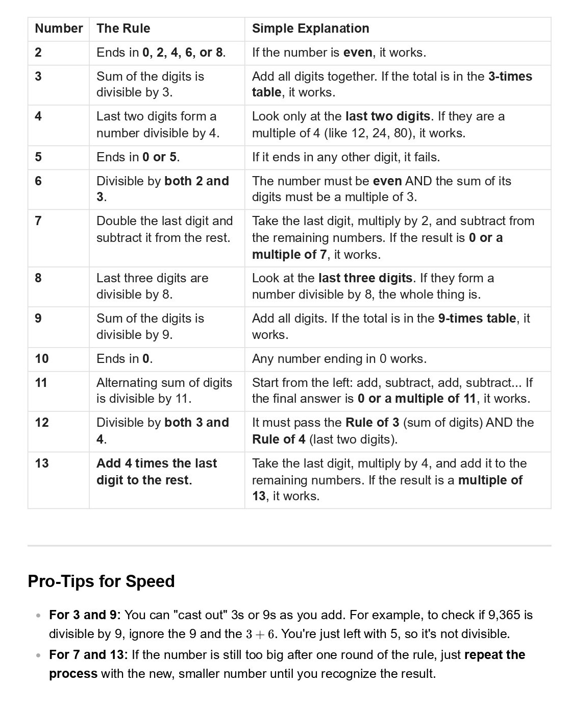

## HCF and LCM

### Prime Factorisation

Break each number down into its prime factors first. Everything else follows from this.

**Example numbers: 12 and 18**

```
12 = 2 × 2 × 3  =  2² × 3¹
18 = 2 × 3 × 3  =  2¹ × 3²
```

---

### Finding HCF

**HCF** (Highest Common Factor) = the biggest number that divides *both* numbers exactly.

**Rule:** Take the **common prime factors** and pick the **lowest power** of each.

```
12 = 2² × 3¹
18 = 2¹ × 3²

Common factors: 2 and 3
Lowest powers:  2¹ and 3¹

HCF = 2¹ × 3¹ = 6
```

So 6 is the largest number that fits into both 12 and 18.

---

### Finding LCM

**LCM** (Lowest Common Multiple) = the smallest number that *both* numbers divide into exactly.

**Rule:** Take **all prime factors** (common or not) and pick the **highest power** of each.

```
12 = 2² × 3¹
18 = 2¹ × 3²

All factors:   2 and 3
Highest powers: 2² and 3²

LCM = 2² × 3² = 4 × 9 = 36
```

So 36 is the smallest number that both 12 and 18 can divide into cleanly.

---

#### One more example — 24 and 36

```
24 = 2³ × 3¹
36 = 2² × 3²
```

**HCF** → common factors, lowest power:

```
2² × 3¹ = 4 × 3 = 12
```

**LCM** → all factors, highest power:

```
2³ × 3² = 8 × 9 = 72
```

---

#### Quick trick to verify

> HCF × LCM = Product of the two numbers

Check: `12 × 72 = 864` and `24 × 36 = 864` ✓

Always works for two numbers. Use it to double-check your answer.

---

!!! tip "The one-line takeaway"
    HCF = what they *share* (lowest powers). LCM = what they *both need* (highest powers). Prime factorisation makes both visible.

---

## Divisibity rules

<figure markdown="span">
    
</figure>

---