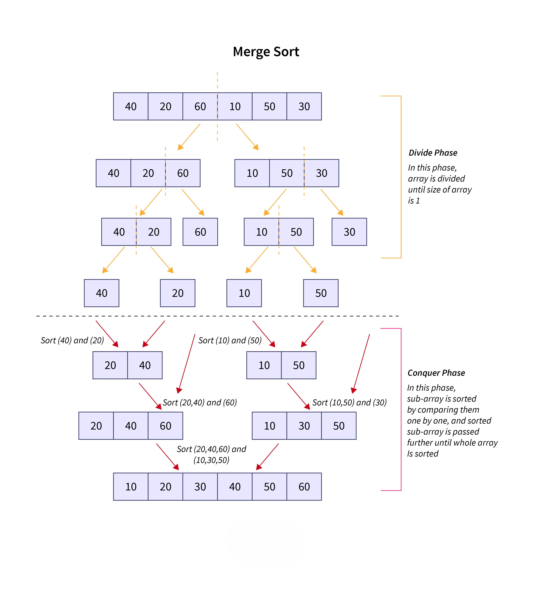

# Sorting Algorithms

Almost every action you take in a web app relies on sorted data. Just looking up a user's profile in a database likely relies on a sorted index 

Fortunately, most programming languages provide their own standard sorting implementation. In Python, for example, we can use the sorted function:

```python
items = [1, 5, 3]
print(sorted(items)) # [1, 3, 5]
```

---

## Bubble Sort

if the standard `sorted()` function exists, why should we learn to write a sorting algorithm from scratch?

In all seriousness, in this we'll be building some of the most famous sorting algorithms from scratch because:

- It's good to understand how they work under the hood
- It's great algorithmic thinking practice

Bubble sort is the sorting algorithm that everyone learns but no one actually uses in the real world — because it's so slow. We learn it because it's easy to understand. And once we appreciate how slow it is, the other sorting algorithms are just that much more impressive.

It all starts with an unsorted list of numbers. Then we loop from left to right and compare each pair of neighbouring numbers. If the number on the right is smaller than the number on the left, we swap them. Otherwise, we leave them alone.

When we get to the end, we go back to the start and do it again. We repeat this over and over until we complete a full pass from left to right without making a single swap — at that point, the list is sorted.

#### Let's walk through a concrete example with `[5, 3, 8, 1, 6]`.

<div style="border:1px solid var(--md-default-fg-color--lightest);border-radius:8px;padding:1.5rem;margin:1.5rem 0;background:var(--md-code-bg-color);">

<div id="bs-bars" style="display:flex;align-items:flex-end;justify-content:center;gap:12px;height:160px;margin-bottom:1rem;"></div>

<div style="display:flex;gap:16px;justify-content:center;margin-bottom:0.75rem;font-size:0.75rem;color:var(--md-default-fg-color--light);">
  <span><span style="display:inline-block;width:12px;height:12px;background:#378ADD;border-radius:2px;margin-right:4px;vertical-align:middle;"></span>Comparing</span>
  <span><span style="display:inline-block;width:12px;height:12px;background:#EF9F27;border-radius:2px;margin-right:4px;vertical-align:middle;"></span>Swapped</span>
  <span><span style="display:inline-block;width:12px;height:12px;background:#639922;border-radius:2px;margin-right:4px;vertical-align:middle;"></span>Sorted</span>
</div>

<div id="bs-info" style="text-align:center;font-size:0.85rem;color:var(--md-default-fg-color--light);min-height:22px;margin-bottom:1rem;">Press Next Step to begin.</div>

<div style="display:flex;gap:8px;justify-content:center;flex-wrap:wrap;">
  <button onclick="bsReset()" style="padding:6px 16px;border-radius:4px;border:1px solid var(--md-default-fg-color--lightest);background:transparent;color:var(--md-default-fg-color);cursor:pointer;font-size:0.85rem;">&#8635; Reset</button>
  <button onclick="bsPrev()"  style="padding:6px 16px;border-radius:4px;border:1px solid var(--md-default-fg-color--lightest);background:transparent;color:var(--md-default-fg-color);cursor:pointer;font-size:0.85rem;">&#8592; Prev</button>
  <button onclick="bsNext()"  style="padding:6px 16px;border-radius:4px;border:1px solid var(--md-default-fg-color--lightest);background:transparent;color:var(--md-default-fg-color);cursor:pointer;font-size:0.85rem;">Next &#8594;</button>
</div>

</div>

<script>
(function () {
  const ORIGINAL = [5, 3, 8, 1, 6];
  const C = { def: '#B4B2A9', cmp: '#378ADD', swp: '#EF9F27', done: '#639922' };
  const MAX = Math.max(...ORIGINAL);
  let history = [], ptr = 0, timer = null;

  function buildHistory(arr) {
    const steps = [], a = [...arr];
    let swapped;
    steps.push({ arr: [...a], i: -1, j: -1, swapped: false, done: false, msg: 'Starting state — unsorted.' });
    do {
      swapped = false;
      for (let j = 0; j < a.length - 1; j++) {
        if (a[j] > a[j + 1]) {
          steps.push({ arr: [...a], i: j, j: j+1, swapped: false, done: false, msg: 'Comparing ' + a[j] + ' and ' + a[j+1] + ' — ' + a[j] + ' > ' + a[j+1] + ', so swap them.' });
          [a[j], a[j+1]] = [a[j+1], a[j]];
          swapped = true;
          steps.push({ arr: [...a], i: j, j: j+1, swapped: true, done: false, msg: 'Swapped! ' + a[j] + ' is now on the left.' });
        } else {
          steps.push({ arr: [...a], i: j, j: j+1, swapped: false, done: false, msg: 'Comparing ' + a[j] + ' and ' + a[j+1] + ' — already in order, no swap needed.' });
        }
      }
      steps.push(swapped
        ? { arr: [...a], i: -1, j: -1, swapped: false, done: false, msg: 'End of pass — going back to the start.' }
        : { arr: [...a], i: -1, j: -1, swapped: false, done: true,  msg: 'No swaps this pass — the list is sorted!' });
    } while (swapped);
    return steps;
  }

  function render(idx) {
    const s = history[idx];
    const el = document.getElementById('bs-bars');
    if (!el) return;
    el.innerHTML = '';
    s.arr.forEach(function(val, i) {
      var color = C.def;
      if (s.done) color = C.done;
      else if (i === s.i || i === s.j) color = s.swapped ? C.swp : C.cmp;
      var h = Math.max(20, Math.round((val / MAX) * 130));
      el.innerHTML += '<div style="display:flex;flex-direction:column;align-items:center;gap:4px;">'
        + '<div style="width:48px;height:' + h + 'px;background:' + color + ';border-radius:4px 4px 0 0;transition:background 0.2s;"></div>'
        + '<span style="font-size:13px;font-weight:500;color:var(--md-default-fg-color--light);">' + val + '</span>'
        + '</div>';
    });
    var info = document.getElementById('bs-info');
    if (!info) return;
    info.innerHTML = s.done
      ? '<span style="background:#e8f5e9;color:#2e7d32;padding:2px 12px;border-radius:99px;font-size:0.8rem;font-weight:500;">Sorted!</span> ' + s.msg
      : s.msg;
  }

  window.bsNext  = function() { if (ptr < history.length - 1) render(++ptr); };
  window.bsPrev  = function() { if (ptr > 0) render(--ptr); };
  window.bsReset = function() { clearInterval(timer); ptr = 0; render(0); };

  history = buildHistory(ORIGINAL);
  render(0);
})();
</script>

Notice what happened — the largest number, 8, got pushed all the way to the right in just one pass. Like a bubble rising to the surface. That's where the name comes from.

**Pass 2, Pass 3...** keep happening until a full pass produces zero swaps. At that point the algorithm knows it's done.

The key insight is this — in the worst case, for every single item in the list, you might have to loop over the entire list again. A **loop inside a loop**. That's **O(n²)** — and it's why bubble sort falls apart the moment your data gets large.

Bubble sort repeatedly steps through a slice and compares adjacent elements, swapping them if they are out of order. It continues to loop over the slice until the whole list is completely sorted. Here's the pseudocode:

### Pseudocode 🧠

1. Set `swapping` to **True**

2. Set `end` to the length of the input list

3. While `swapping` is **True**:

    1. Set `swapping` to **False**

    2. For i from the 2nd element to end:

        - If the `(i-1)th` element of the input list is greater than the `ith` element:

            a. Swap the `(i-1)th` element and the `ith` element  
            b. Set `swapping` to **True**

    3. Decrement `end` by one

4. Return the sorted list


!!! note ""
    **Try to Create the bubble_sort algorithm according to the described Pseudocode above.**


??? example "Reveal: bubble_sort"
    ```python
    def bubble_sort(nums):
        swapping = True
        end = len(nums)

        while swapping:
            swapping = False
            for i in range(1, end):
                if nums[i-1] > nums[i]:
                    #swapping 2 values without temp
                    nums[i-1], nums[i] = nums[i], nums[i-1] 
                    swapping = True
            end-=1
        return nums
    ```

### Best and Worst Case

In the case of bubble sort, the best and worst case scenarios can actually change the time complexity: 

- **Best case**: If the data is pre-sorted, bubble sort becomes really fast. Because it only need to do one pass
- **Worst case**: If the data is in reverse order, bubble sort becomes really slow (but still in the same complexity class as random data). Because every comparison leads to a swap, resulting in the maximum number of operations (O(n²)).

!!! Question "Why Bubble Sort"
    Bubble sort is famous for how easy it is to write and understand.

    However, it's one of the slowest sorting algorithms, and as a result is almost never used in practice. That said, we covered it because it's a useful thought exercise so that you can appreciate why the more complex and performant algorithms are better. 

---

## Merge Sort

**Merge sort** is a recursive sorting algorithm and it's quite a bit faster than bubble sort. It's a divide and conquer algorithm.:

- **Divide**: divide the large problem into smaller problems, and recursively solve the smaller problems
- **Conquer**: Combine the results of the smaller problems to solve the large problem

In merge sort we:

- Divide the array into two (equal) halves (divide)
- Recursively sort the two halves
- Merge the two halves to form a sorted array (conquer)

Merge sort is much more efficient than bubble sort. In Big O terms it's **O(n log n)** — compared to bubble sort's shameful O(n²), that's a massive improvement. And O(n log n) is actually about as good as it gets for sorting a fully unsorted list.

But before we get carried away — merge sort isn't perfect. A few honest trade-offs:

- It needs **extra memory**. It makes copies of the list to work with, so it uses more RAM than an algorithm that sorts the list in place.
- It's actually **slower than simpler algorithms like insertion sort on small lists** — because all that memory copying, allocation, and recursive function calling has a constant cost. It doesn't affect the Big O category, but it shows up in real performance, and it hurts more on smaller inputs.

So merge sort wins at scale. For small lists, something simpler might actually beat it in practice.


### Working

Merge sort is a **divide and conquer** algorithm. It has two phases — split, then merge.

**Phase 1 — Split:**
Take your unsorted list. Cut it in half. Take each half and cut those in half. Keep going recursively until every piece has just one item. A list of one item is already sorted — there's nothing to compare.

**Phase 2 — Merge:**
Now work back up. Take two single-item lists and merge them into a sorted two-item list. Take two two-item lists and merge them into a sorted four-item list. Keep going until you're back to one fully sorted list.

The merge step itself is simple — look at the first item in both lists, pick the smaller one, move it into the new sorted list, and advance. Repeat until both lists are empty.

<figure markdown="span">
    
</figure>


The algorithm consists of two separate functions, `merge_sort()` and `merge()`: 

- `merge_sort()` divides the input array into two halves, calls itself on each half, and then merges the two sorted halves back together in order.

- The `merge()` function merges two already sorted lists back into a single sorted list. At the lowest level of recursion, the two "sorted" lists will each only have one element. Those single element lists will be merged into a sorted list of length two, and we can build from there.

In other words, all the "real" sorting happens in the `merge()` function.


### Pseudocode 🧠

#### merge_sort()

Input: `A`, an unsorted list of integers

1. If the length of `A` is less than 2, it's already sorted so return it

2. Split the input array into two halves down the middle

3. Call `merge_sort()` twice, once on each half

4. Return the result of calling `merge(sorted_left_side, sorted_right_side)` on the results of the `merge_sort()` calls


#### merge ()

Inputs: `A` and `B`. Two sorted lists of integers

1. Create a new final list of integers

2. Set `i` and `j` equal to zero. They will be used to keep track of indexes in the input lists (`A` and `B`)

3. Use a loop to compare the current elements of `A` and `B`:

   - If an element in `A` is less than or equal to its respective element in `B`, add it to the final list and increment `i`

   - Otherwise, add the item in `B` to the final list and increment `j`

   - Continue until all items from one of the lists have been added

4. After comparing all the items, there may be some items left over in either `A` or `B`. Add those extra items to the final list

5. Return the final list

!!! note ""
    **Try to Create merge_sort() & merge() algorithms according to the described Pseudocode above.**


??? example "Reveal: merge_sort"
    ```python
    def merge_sort(nums):
        if len(nums) < 2:
            return nums
        mid = len(nums) // 2
        left = merge_sort(nums[:mid])
        right = merge_sort(nums[mid:])
        return merge (left, right)
    ```

??? example "Reveal: merge"
    ```python
    def merge(first, second):
        result = []
        i = j = 0

        while i < len(first) and j < len(second):
            if first[i] <= second[j]:
                result.append(first[i])
                i += 1
            else:
                result.append(second[j])
                j += 1

        while i < len(first):
            result.append(first[i])
            i += 1

        while j < len(second):
            result.append(second[j])
            j += 1

        return result
    ```


### Big O

Two things are happening:

- The **splitting** takes O(log n) levels — same reason binary search does. Every level halves the list.
- At **each level**, every single item in the list gets looked at once during the merge step — that's O(n).

Multiply them together: **O(n log n)**.


### Best and Worst Case

In the case of merge sort, the best and worst case scenarios do not change the time complexity:

- **Best case**: Even if the data is already sorted, merge sort still divides the list and merges it back. Because it always performs the same number of splits and merges, the time complexity remains **O(n log n)**

- **Worst case**: Even if the data is in reverse order, merge sort still performs the same sequence of operations. Because the algorithm does not depend on the initial order of data, the time complexity remains **O(n log n)**

!!! Question "Why Merge Sort"
    Pros:

    - **Fast**: Merge sort is much faster than bubble sort. O(n*log(n)) instead of O(n^2).

    -  **Stable**: Merge sort is a stable sort which means that values with duplicate keys in the original list will be in the same order in the sorted list.

    Cons:

    - **Memory usage**: Most sorting algorithms can be performed using a single copy of the original array. Merge sort requires extra subarrays in memory.

    - **Recursive**: Merge sort requires many recursive function calls, and in many languages (like Python), this can incur a performance penalty.

---

## Insertion Sort

Insertion sort is interesting — on paper it looks bad, but it has a real-world niche that keeps it alive.

In the average case it's **O(n²)**, same shameful category as bubble sort. But two situations make it genuinely useful in practice:

- The data is **already mostly sorted**
- The data set is **very small**

!!! tip "Real world"
    Some sorting libraries switch to insertion sort automatically when the dataset is small enough, then fall back to a faster algorithm for larger sets.


### Working

We start with an unsorted list of numbers. We iterate over each position from left to right, and we keep track of two indexes — `i` and `j`.

`i` is the current position we're on. `j` starts at that same position, but it moves to the left. Because this is a look-back algorithm, we can skip the first index entirely — a single item is already sorted. So both `i` and `j` start at index 1, the second position.

Now, the actual swapping happens between the number at `j` and the number at `j - 1`. `i` has nothing to do with the swapping — it just keeps our place in the algorithm.

So we look at `arr[j]` and `arr[j - 1]`. If they're out of order (means `arr[j - 1]` > `arr[j]`), we swap them and move `j` one step to the left. If they're already in order, we leave them alone, increment `i`, and reset `j` back to where `i` is.

Near the start of the list, `j` barely has to backtrack at all — maybe one or two steps. But as `i` gets larger and larger, `j` could potentially slide all the way back to the beginning. That's where the O(n²) cost creeps in.

And here's the key insight about why it shines on nearly-sorted data — if every element is already close to where it belongs, `j` almost never has to move left. Each pass is basically one comparison and done. The algorithm just glides through the list. That's why it beats merge sort in that specific case, even though merge sort wins everywhere else at scale.


#### Let's walk through a concrete example with `[5, 3, 8, 1, 6]`.

<div style="border:1px solid var(--md-default-fg-color--lightest);border-radius:8px;padding:1.5rem;margin:1.5rem 0;background:var(--md-code-bg-color);">

<div id="is-bars" style="display:flex;align-items:flex-end;justify-content:center;gap:12px;height:160px;margin-bottom:1rem;"></div>

<div style="display:flex;gap:16px;justify-content:center;flex-wrap:wrap;margin-bottom:0.75rem;font-size:0.75rem;color:var(--md-default-fg-color--light);">
  <span><span style="display:inline-block;width:12px;height:12px;background:#378ADD;border-radius:2px;margin-right:4px;vertical-align:middle;"></span>j — comparing</span>
  <span><span style="display:inline-block;width:12px;height:12px;background:#7F77DD;border-radius:2px;margin-right:4px;vertical-align:middle;"></span>i — current position</span>
  <span><span style="display:inline-block;width:12px;height:12px;background:#639922;border-radius:2px;margin-right:4px;vertical-align:middle;"></span>Sorted</span>
</div>

<div id="is-info" style="text-align:center;font-size:0.85rem;color:var(--md-default-fg-color--light);min-height:22px;margin-bottom:1rem;">Press Next Step to begin.</div>

<div style="display:flex;gap:8px;justify-content:center;flex-wrap:wrap;">
  <button onclick="isReset()" style="padding:6px 16px;border-radius:4px;border:1px solid var(--md-default-fg-color--lightest);background:transparent;color:var(--md-default-fg-color);cursor:pointer;font-size:0.85rem;">&#8635; Reset</button>
  <button onclick="isPrev()"  style="padding:6px 16px;border-radius:4px;border:1px solid var(--md-default-fg-color--lightest);background:transparent;color:var(--md-default-fg-color);cursor:pointer;font-size:0.85rem;">&#8592; Prev</button>
  <button onclick="isNext()"  style="padding:6px 16px;border-radius:4px;border:1px solid var(--md-default-fg-color--lightest);background:transparent;color:var(--md-default-fg-color);cursor:pointer;font-size:0.85rem;">Next &#8594;</button>
</div>

</div>

<script>
(function () {
  var ORIGINAL = [5, 3, 8, 1, 6];
  var C = { def: '#B4B2A9', i: '#7F77DD', j: '#378ADD', done: '#639922' };
  var MAX = Math.max.apply(null, ORIGINAL);
  var history = [], ptr = 0;

  function buildHistory(arr) {
    var steps = [], a = arr.slice();
    steps.push({ arr: a.slice(), iPos: -1, jPos: -1, done: false, msg: 'Starting state — unsorted.' });
    var i = 1;
    while (i < a.length) {
      var j = i;
      steps.push({ arr: a.slice(), iPos: i, jPos: j, done: false, msg: 'i=' + i + ', j=' + j + ' — looking at ' + a[j] + ', comparing with left neighbour ' + a[j-1] + '.' });
      while (j > 0 && a[j] < a[j - 1]) {
        steps.push({ arr: a.slice(), iPos: i, jPos: j, done: false, msg: a[j] + ' < ' + a[j-1] + ' — swapping.' });
        var tmp = a[j]; a[j] = a[j-1]; a[j-1] = tmp;
        steps.push({ arr: a.slice(), iPos: i, jPos: j - 1, done: false, msg: 'Swapped. ' + a[j] + ' moved right, ' + a[j-1] + ' moved left. j moves left.' });
        j--;
      }
      if (j === 0 || a[j] >= a[j-1]) {
        steps.push({ arr: a.slice(), iPos: i, jPos: j, done: false, msg: a[j] + ' is in the right place. Moving i forward.' });
      }
      i++;
    }
    steps.push({ arr: a.slice(), iPos: -1, jPos: -1, done: true, msg: 'The list is fully sorted!' });
    return steps;
  }

  function render(idx) {
    var s = history[idx];
    var el = document.getElementById('is-bars');
    if (!el) return;
    el.innerHTML = '';
    s.arr.forEach(function (val, i) {
      var color = C.def;
      if (s.done) color = C.done;
      else if (i === s.jPos) color = C.j;
      else if (i === s.iPos) color = C.i;
      var h = Math.max(20, Math.round((val / MAX) * 130));
      el.innerHTML += '<div style="display:flex;flex-direction:column;align-items:center;gap:4px;">'
        + '<div style="width:48px;height:' + h + 'px;background:' + color + ';border-radius:4px 4px 0 0;transition:background 0.2s;"></div>'
        + '<span style="font-size:13px;font-weight:500;color:var(--md-default-fg-color--light);">' + val + '</span>'
        + '</div>';
    });
    var info = document.getElementById('is-info');
    if (!info) return;
    info.innerHTML = s.done
      ? '<span style="background:#e8f5e9;color:#2e7d32;padding:2px 12px;border-radius:99px;font-size:0.8rem;font-weight:500;">Sorted!</span> ' + s.msg
      : s.msg;
  }

  window.isNext  = function () { if (ptr < history.length - 1) render(++ptr); };
  window.isPrev  = function () { if (ptr > 0) render(--ptr); };
  window.isReset = function () { ptr = 0; render(0); };

  history = buildHistory(ORIGINAL);
  render(0);
})();
</script>

The step message tells you exactly what `i` and `j` are doing at each moment — watch how `j` slides left when it finds something out of order, and snaps back to `i` when the pair is already in place. On nearly-sorted data you'll see `j` barely move at all. That's why it's fast in that specific case.

### Pseudocode 🧠 

1. For each index `i` from `0` to the length of the list:

   1. Set `j` to `i`

   2. While `j` is greater than `0` and the element at index `j-1` is greater than the element at index `j`:

      1. Swap the elements at indices `j-1` and `j`

      2. Decrement `j` by `1`

2. Return the list

!!! note ""
    **Try to Create insertion_sort() algorithm according to the described Pseudocode above.**


??? example "Reveal: insertion_sort"
    ```python
    def insertion_sort(nums):
        for i in range(1, len(nums)):
            j = i

            while j > 0 and nums[j-1] > nums[j]:
                nums[j-1], nums[j] = nums[j], nums[j-1]
                j -= 1
        return nums
    ```

### Big O

Insertion sort has a Big O of **O(n^2)**, because that is its worst case complexity.

The outer loop of insertion sort always executes n times, while the inner loop depends on the input:

- Best case: If the data is pre-sorted, insertion sort becomes really fast. Because we just need to check every element once.
- Average case: The average case is O(n^2) because the inner loop will execute about half of the time.
- Worst case: If the data is in reverse order, it's still O(n^2) and the inner loop will execute every time.

!!! Question "Why Use Insertion Sort"
    - Fast: for very small data sets (even faster than merge sort and quick sort, which we'll cover later)
    - Adaptive: Faster for partially sorted data sets
    - Stable: Does not change the relative order of elements with equal keys
    - In-Place: Only requires a constant amount of memory
    - Inline: Can sort a list as it receives it

!!! info "Why Is Insertion Sort Fast for Small Lists"
    Many production sorting implementations use insertion sort for very small inputs under a certain threshold (very small, like 10-ish), and switch to something like quicksort for larger inputs. They use insertion sort because:

    - There is no recursion overhead
    - It has a tiny memory footprint
    - It's a stable sort as described above

---

