## Algorithms

An algorithm is just a clear, step-by-step set of instructions to solve a problem or complete a task. In programming, it's the logic behind your code — the thinking before the typing.

Important points (keep these in your head):

- It must be **step-by-step**
- It must be **clear** — no ambiguity
- It must **end** — finite steps
- It must **solve a specific problem**

👉 **Coding is just writing an algorithm in a programming language.**  

If your thinking is weak, your code will be weak — no matter how many languages you learn.

---

#### Find Minimum — A Simple Example

A good first algorithm to understand: find the smallest number in a list.

The approach is straightforward:

1. Set `minimum` to positive infinity — `float("inf")` — so any real number will be smaller
2. Walk through each number in the list; if it's smaller than `minimum`, update `minimum`
3. At the end, `minimum` holds the answer

```python title="find_minimum.py"
def find_minimum(nums):
    if not nums:
        return None

    min = float("inf")

    for num in nums:
        if num < min:
            min = num

    return min
```

!!! tip "Real talk"
    Python has a built-in `min()` function that does this in one line. But writing it manually is the point — this is how you start *seeing* what an algorithm actually is.

---

#### Efficiency Matters — Even for Simple Problems

Now consider finding the longest string in a list: 

```python title="find_longest_string.py"
def find_longest_string(lst):
    longest_so_far = ""

    for s in lst:
        if len(s) > len(longest_so_far):
            longest_so_far = s

    return longest_so_far
```

With five strings, this is instant. With 5 billion? That's where it gets interesting — and that's exactly the kind of question computer science asks you to sit with.

!!! info 
    If you've heard (usually exaggerated) stories about Leetcode and whiteboarding interviews, you might hear the word "algorithm" and think it's synonymous with "hard problem." That's really not the case, and believing it will only psych you out.


!!! quote "Seneca"
    *"We suffer more often in imagination than in reality."*

---

## Mathematics

### Exponents

Exponent means: “Multiply a number by itself multiple times”

Example:

- 2<sup>3</sup> = 2 × 2 × 2 = 8
- 5<sup>2</sup> = 5 × 5 = 25

in python it can be implemented through :

1. Using ** (Most important)
```python
print(2 ** 3)   # 8
print(5 ** 2)   # 25
```
This is the standard way in Python.

2. Using pow() function
```python
print(pow(2, 3))   # 8
```

**Additional Points**

Anything raised to 1 is that number itself, and anything raised to 0 is 1.

**x¹ = x**  
Examples: 2¹ = 2, 3¹ = 3

**x⁰ = 1**  
Examples: 4⁰ = 1, 5⁰ = 1

!!! info  "Real world Scenario"
    Exponents are important to understand when it comes to the execution speed of an algorithm. If the number of operations grows quickly as the amount of input data increases, the algorithm will become slower and slower.


<figure markdown="span">
    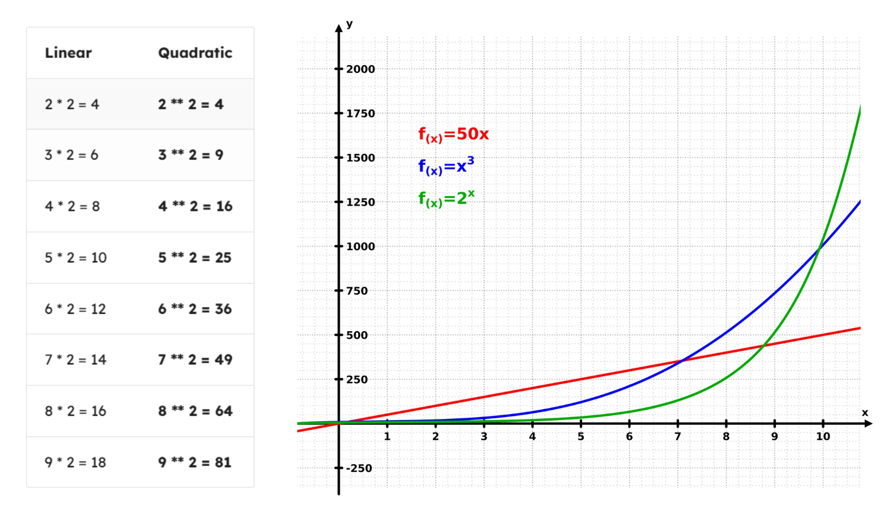
</figure>

The result of exponentiation get really big really quick for instance 2^6 is actually the double of 2^5

**What does this have to do with code?**

Generally we try to avoid writing code that causes the usage of a resource to grow quadratically (with an exponent):

- Sometimes that's a lot of computations (CPU utilization / slowness)
- Sometimes that's a lot of memory usage (RAM utilization)
- Sometimes that's a large storage requirement (disk space)

A notable exception is in cryptography and security: we want to force attackers to waste resources trying to get at our information.

---

### Logarithms

**Logarithm means:** the inverse of an exponent.

> "How many times do I multiply a number to get another number?"

**Example:**

log<sub>2</sub>(8) = 3 — because 2<sup>3</sup> = 8

So: **log = reverse of exponent**

What we need to register is: log base 2 of X means — *what power do we raise 2 to, in order to get X?*

log<sub>2</sub>(16) = ? → 2<sup>4</sup> = 16 → **log<sub>2</sub>(16) = 4**

The base doesn't need to be 2. In programming it's common because we work in binary, but it can also be base 10:

log<sub>10</sub>(1000) = 3 — because 10<sup>3</sup> = 1000

<figure markdown="span">
    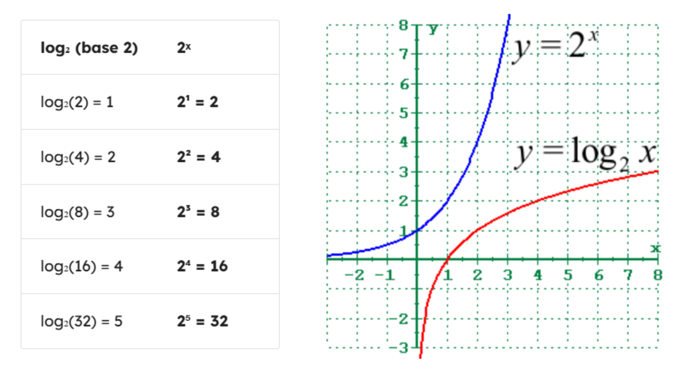
</figure>

Opposite to exponential, logarithms grow very slowly by comparison.


!!! info  "Real world Scenario"
    This is really useful in coding and computer science. When a program slows down at an **exponential rate**, it gets painfully slow as input grows. But if it slows down at a **logarithmic rate**, it stays fast — even at scale. That distinction matters a lot.


| Input Size | Linear (n × 2) | Quadratic (n²) | Logarithmic (log₂ n) |
|------------|----------------|----------------|----------------------|
| 10 | 20 ms | 100 ms | 3 ms |
| 100 | 200 ms | 10,000 ms | 7 ms |
| 1,000 | 2,000 ms | 1,000,000 ms | 10 ms |
| 10,000 | 20,000 ms | 100,000,000 ms | 14 ms |
| 100,000 | 200,000 ms | 10,000,000,000 ms | 17 ms |
| 1,000,000 | 2,000,000 ms | 1,000,000,000,000 ms | 20 ms |

!!! info
    1,000,000,000,000 ms = 31.7 years

Calculating log isn't a built-in language operation — we import the `math` module:

**Syntax:**
```python
import math

math.log(x, base)
```

**Example:**
```python
import math

print(f"log base 2 of 16 is {math.log(16, 2)}")
```

---

### Factorials

**Factorial means**: The factorial of a number `n` (written as `n!`) is the product of all positive integers from `1` up to `n`.

```
5! = 5 × 4 × 3 × 2 × 1 = 120
```

!!! tip "The growth problem"
    Factorials grow *extremely* fast — faster than exponential functions like `2ⁿ`.

<!-- image section -->
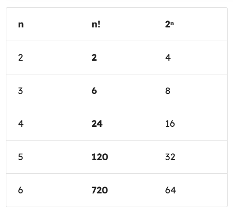{ align="left" width="300" }

By `n = 4`, `n!` has already overtaken `2ⁿ` — and it never looks back.

Factorials show up whenever you're counting **arrangements** — like how many ways you can shuffle a deck of cards, or seat people at a table.

#### Try it yourself

Before looking at the code — can you write a function that calculates `n!`?

Think about the base case first: what is `0!` or `1!`?

??? example "Reveal: Iterative approach"
    ```python
        def factorial(n: int) -> int:
            result = 1
            for i in range(2, n + 1):
                result *= i
            return result

        print(factorial(5))  # 120
    ```

??? example "Reveal: Recursive approach"
    ```python
        def factorial(n: int) -> int:
            if n == 0 or n == 1:
                return 1
            return n * factorial(n - 1)

        print(factorial(5))  # 120
    ```

!!! note "Python has this built in"
    ```python
        import math
        math.factorial(5)  # 120
    ```

---

## Big - O Analysis

**Big O analysis** is just a way for us as computer scientists and programmers to categorize different algorithms by **how they slow down as the input size to the algorithm grows**. Like super roughly speaking, it's a way for us to talk about how slow or how fast algorithms can run. And to be very specific, we're worried about the worstcase runtime.

---

### linear time - Big O(n)

Let us consider a function to calculate products: 
Assuming that the list of numbers we pass in has just a single item in it

<figure markdown="span">
    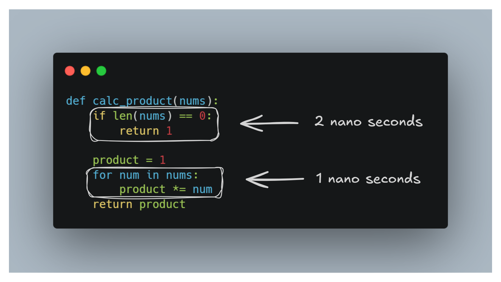
</figure>

Let's look at this function and break down exactly what's happening step by step.

The first two lines of code, they do a fixed amount of work. They don't look at the list, they don't loop over anything. They just run and finish. So we say they take **2 nanoseconds**, no matter what.

Then comes the loop — and this is where the input size starts to matter: 

- Pass in **1 item** — the loop runs once. 1 nanosecond. Add the 2 from the top. **Total: 3 nanoseconds.**
- Pass in **5 items** — the loop runs 5 times. 5 nanoseconds. The first two lines still take just 2. **Total: 7 nanoseconds.**
- Pass in **10,000 items** — the loop runs 10,000 times. 10,000 nanoseconds. The first two lines? Still 2. **Total: 10,002 nanoseconds.**

Now here's the key insight. That **2 nanoseconds at the top becomes completely irrelevant** as the input grows. At 10,000 items, it's a rounding error. At a million items, nobody cares about it. So when we're thinking about Big O, we strip it away entirely and just focus on what's actually scaling — the loop.

And the loop scales **one step per one item**. That's a straight line on a graph. All this to say, this function has a **Big O categorization of O(n), or linear time, because the amount of time it takes to run the function is linearly proportional to the input size—the size of the list coming into the function**.

The rule of thumb to remember: **if you see a single loop running over your input, you're almost certainly looking at O(n).** The constant stuff above and below it doesn't change the category.


<figure markdown="span">
    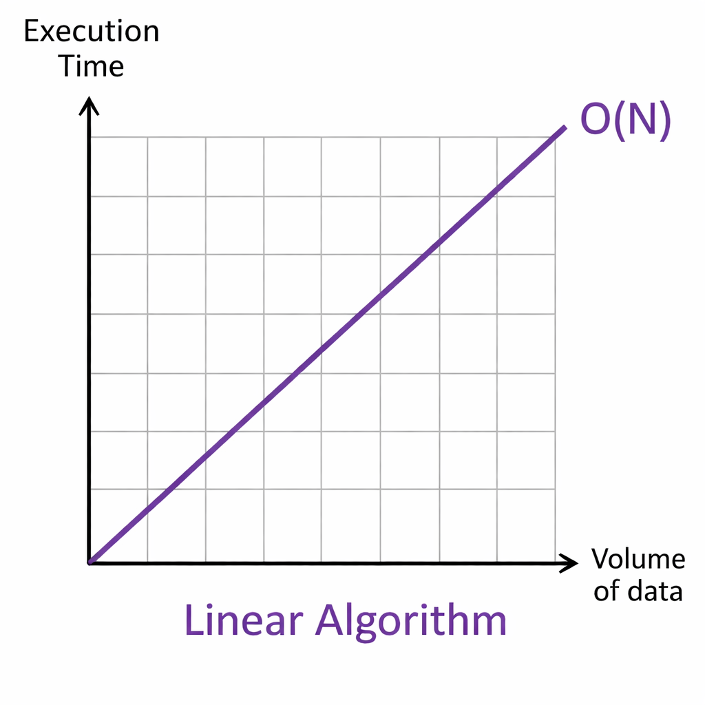{width="400"}
</figure>

---

### Constant Time - Big O(1)

<figure markdown="span">
    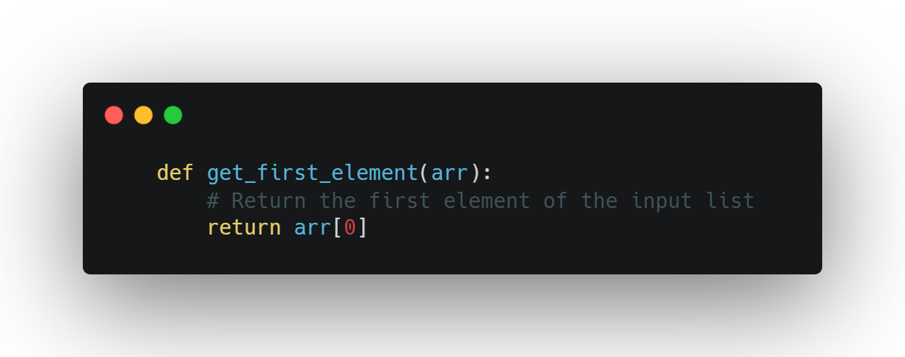
</figure>

In this case the getFirstElement function instantly returns the element of the given array without any loops or iterations. Irrespective of how large the array's this algorithm maintains an execution time, which classifies it as O(1). Because it does not care if it is only one element or 10 million it just returns the first element

This function has a **Big O categorization of O(1), or Constant time**

<figure markdown="span">
    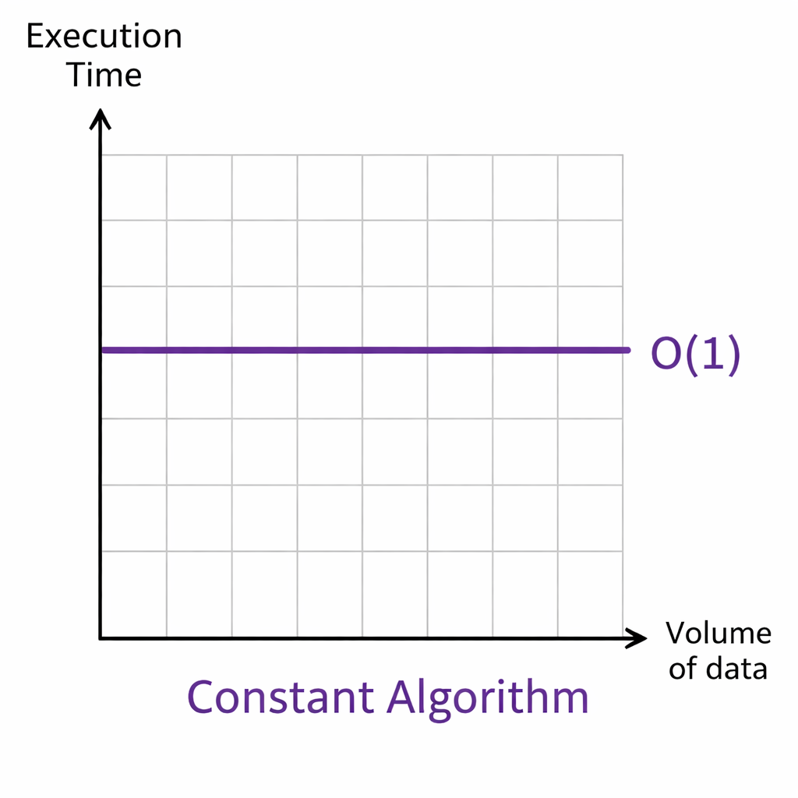{width="400"}
</figure>

---

### Quadratic time - Big O(n²)

<figure markdown="span">
    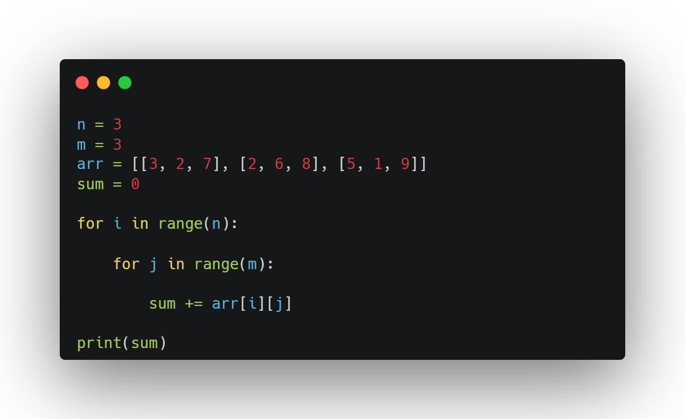
</figure>

We start by defining two variables, **n** and **m**, both set to 3. Think of **n** as the number of rows and **m** as the number of columns in our grid. Then we have **arr**- a 2D array, basically a list of lists. Picture it like a 3x3 table with numbers inside. We also define **sum** as 0, because we're going to be adding things into it.

Now the algorithm has two loops — an outer loop and an inner loop nested inside it.

The **outer loop** runs over every row. So with n = 3, it runs 3 times — once for row 0, once for row 1, once for row 2. **So: 1 + 1 + 1 = 3**

For **each** of those row iterations, the **inner loop** runs over every column. With m = 3, that's 3 more iterations — picking up each individual number in that row and adding it to sum.

So what's the total number of steps? It's not 3. It's not 3 + 3. It's **3 × 3 = 9 total additions**.

Let's scale it up: 

- If n and m are both 2 — a 2×2 grid — that's 4 steps. 
- If they're both 4 — a 4×4 grid — that's 16 steps. 
- If they're both 100 — a 100×100 grid — that's **10,000 steps**.

You see the pattern? Every time n and m grow together, the total work grows **quadratically** — this is what's called an **O(n²)** algorithm. If you plotted the runtime on a graph as the grid gets bigger, you'd see a parabolic curve shooting upward, not a straight line.

<figure markdown="span">
    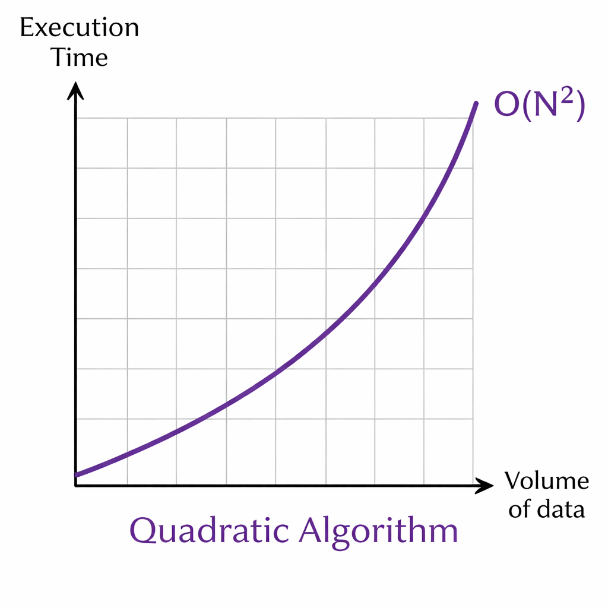{width="400"}
</figure>

We try to avoid this algorthims, For small input sizes, it's totally fine. But if you're dealing with massive inputs — say, image processing or a huge dataset — this kind of nested loop can get slow very quickly.

---

### logarithmic time - Big O(log(n))

Let's talk about **binary search** — one of the most elegant algorithms out there.

Imagine you have a list of 1,000 items and you're looking for a specific one. A basic search would go one by one, that could mean up to 1,000 steps in the worst case. Binary search does something much smarter. At every step, it **cuts the list in half** and asks is my item in the left half or the right half? Then it throws away the half it doesn't need and repeats.

Let's walk through the numbers:

- A list of **4 items** — chop to 2, chop to 1. That's **2 steps**.
- A list of **8 items** — chop to 4, chop to 2, chop to 1. That's **3 steps**.
- A list of **16 items** — chop to 8, chop to 4, chop to 2, chop to 1. That's **4 steps**.

Notice what's happening here. Every time we **double the list size**, the number of steps only goes up by **one**. That's the magic.

So by the time you're at **1 million items**, binary search needs only about **20 steps**. Bump it up to 10 million? Maybe 23 steps. A trillion items? Around **40 steps**.

This is called **O(log n)** — logarithmic time. The algorithm grows so slowly that for any practical input size, it almost feels like it's running in constant time.

Think of it this way — if O(n²) is a parabola shooting upward, O(log n) is nearly flat. It barely flinches no matter how big the input gets.

<figure markdown="span">
    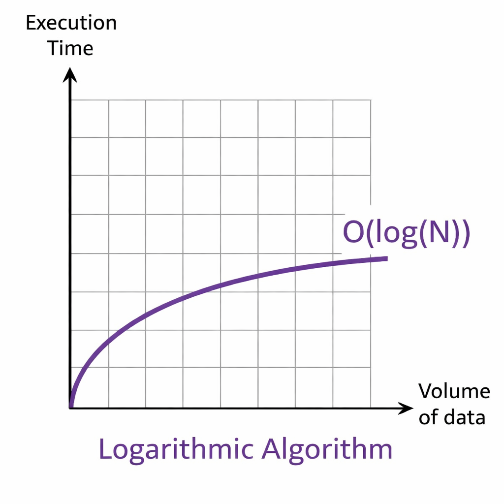{width="400"}
</figure>

---

### Exponential time - Big O(2ⁿ) { #exponential-time }

Now let's talk about the scariest one — **exponential time**, written as **O(2ⁿ)**.

With every single complexity class we've looked at so far, bigger input meant more work — but it was still manageable. Exponential time is a completely different beast.

Here's how fast it blows up: 

- An input of **n = 1** — just **2 iterations**.
- An input of **n = 2** — **4 iterations**.
- An input of **n = 10** — **1,024 iterations**.
- An input of **n = 15** — already over **30,000 iterations**.
- An input of **n = 30** — over **1 billion iterations**. Your program is just not finishing. Go get lunch. Go to sleep. It's still running.

See what's happening? Every time n goes up by just **one**, the total work **doubles**. Not adds a little. Not grows steadily. **Doubles**. That's why it spirals out of control so fast — the growth is relentless.

Now here's the fascinating flip side. **Cybersecurity actually depends on this.**

Encryption works by creating a problem that would take an exponential algorithm to brute force — meaning an attacker trying every possible combination would need billions of years of computing time to crack it. The algorithm being impossibly slow is the entire point. It's the lock on the door.

<figure markdown="span">
    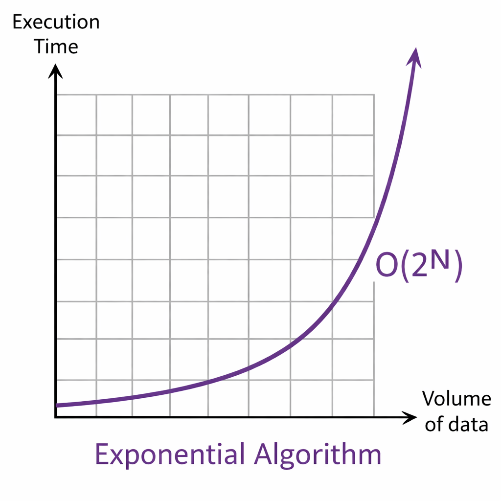{width="400"}
</figure>

---

So to wrap up the whole picture — here's how all the complexity classes stack up, from fastest to slowest:

- **O(1)** — constant. Doesn't grow at all.
- **O(log n)** — barely grows. Binary search.
- **O(n)** — grows linearly. One step per item.
- **O(n²)** — grows quadratically. Nested loops.
- **O(2ⁿ)** — exponential. Practically unusable at any real scale.

<figure markdown="span">
    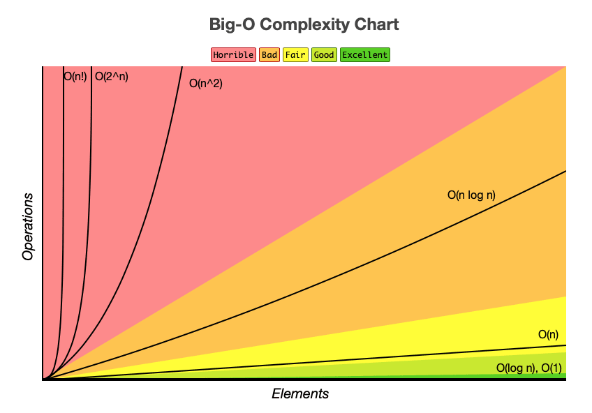
</figure>

---

**Big O doesn't care about seconds. It cares about shape.**

Specifically, it only asks one question — as the input grows, how does the work grow? Not how long it takes on your machine, not how fast your CPU is, not whether it runs in 1 nanosecond or 5 seconds. Just the **proportional change**.

So if a function takes 5 seconds on 10,000 items and still takes 5 seconds on 10 million items — that's **O(1), constant time**. The runtime didn't change as the input grew. We don't say "O(5) because it took 5 seconds." That 5 just collapses down to 1. Constants always do.

Now here's where it gets interesting.

You have a `sum` function — loops over the list once, adds everything up. Clearly **O(n)**.

Then you have a `tripleSum` function — does the exact same loop, but three times back to back. So it takes **three times as long**. Wouldn't that make it **O(3n)?**

Technically yes. But in Big O analysis, we don't care. That 3 is a constant. It gets dropped. It's still just **O(n).**

Why? Because the **shape of growth** hasn't changed. Whether you loop once or three times, if the input doubles, the runtime doubles. It's still a straight line on the graph — just a slightly steeper one. And Big O only cares about the shape, not the steepness.


Here's the practical split to keep in your head:

- **As a computer scientist** doing Big O analysis — constants don't exist. Drop them.
- **As a software engineer** shipping real code — constants matter enormously. A constant-time function that takes 5 seconds per call will destroy your user experience.

Big O tells you how your code **scales**. It doesn't tell you if your code is **fast enough**. Both questions matter — just at different moments.

