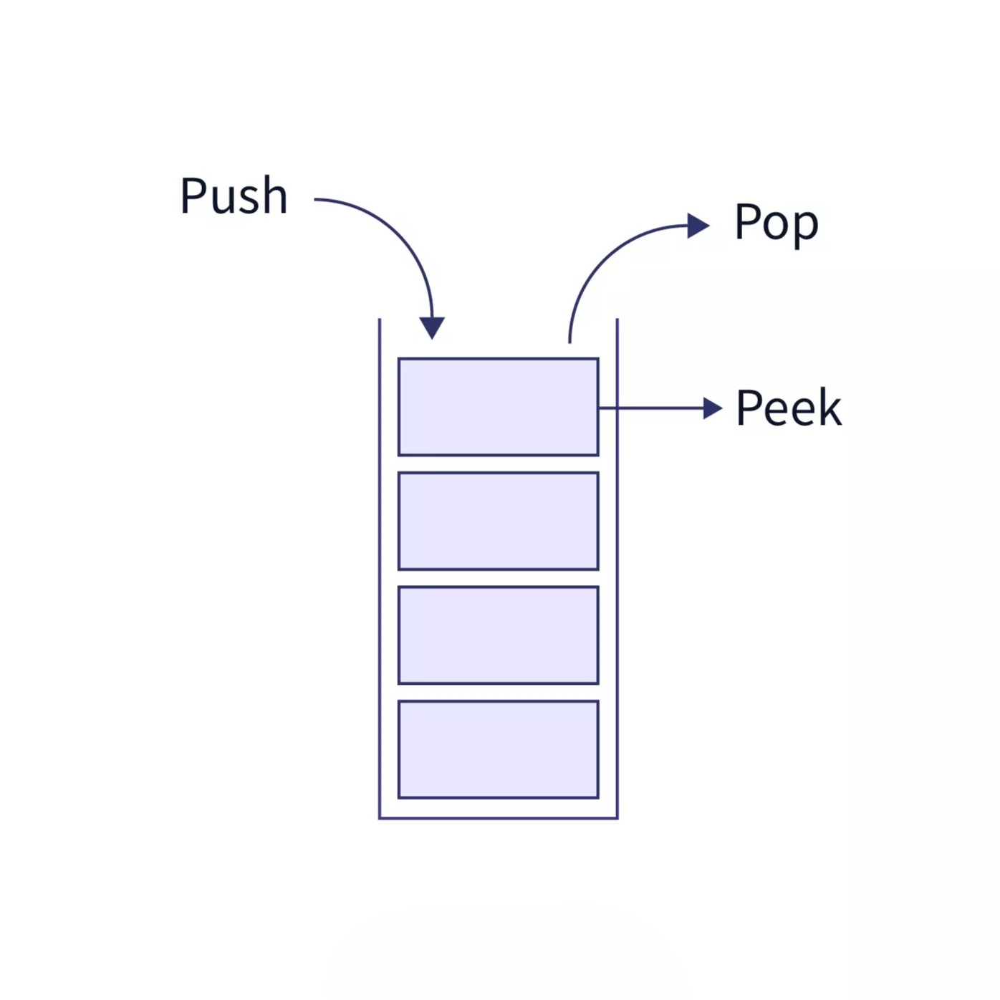
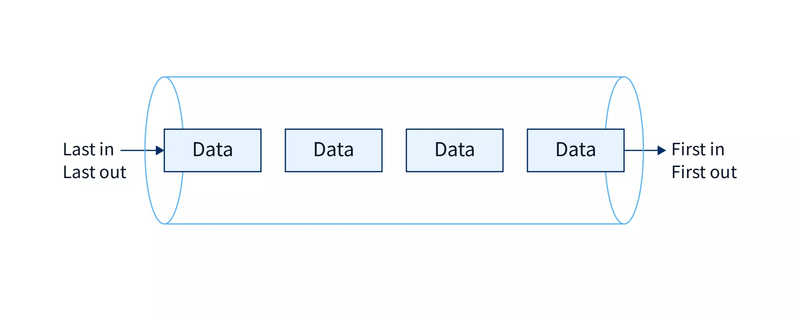

## Stack

{ align=right width=300 }

In computer science, a stack is an abstract data type that serves as a collection of elements with some operations:

- **push** — add an item to the top
- **pop** — remove and return the item at the top
- **peek** — look at the top item without removing it
- **size** — how many items are currently in the stack

The name stack is an analogy to a set of physical items stacked one atop another, such as a stack of plates.

The order in which elements are added to or removed from a stack is described as last in, first out, referred to by the acronym **LIFO**.

### Real world Examples

- **Undo/redo** in any text editor — every action gets pushed onto a stack. Ctrl+Z pops the last one.
- **Browser history** — hitting the back button pops the current page off the stack.
- **The call stack** — when functions call other functions, your program uses a stack to track where to return.

### Speed

Here's the thing — that restriction is what makes stacks *fast*.

Every single one of those four operations is **O(1)**. Constant time. Doesn't matter if you have 10 items or 10 million — push, pop, peek, and size are all instant.

The trade-off: if you want something buried at the bottom, you have to pop everything above it first. That's O(n). But if you're using a stack correctly, you never need to do that.

### Python code

Under the hood, a stack is just a list with guardrails.

```python
# Stack example using a Python list

stack = []

# Push elements onto the stack
stack.append(10)
stack.append(20)
stack.append(30)

print("Stack after push operations:", stack)

# Peek at the top element
if stack:
    print("Top element (peek):", stack[-1])
else:
    print("Stack is empty")

# Pop the top element
if stack:
    popped_item = stack.pop()
    print("Popped element:", popped_item)
else:
    print("Stack is empty")

print("Stack after pop operation:", stack)

# Get the size of the stack
print("Size of the stack:", len(stack))

# Check whether the stack is empty
if len(stack) == 0:
    print("Stack is empty")
else:
    print("Stack is not empty")
```


The "top of the stack" is just the end of the list. `append` adds to the end. `items[-1]` reads from the end. `del items[-1]` removes from the end. Python's list makes all of this O(1).

One subtle bug to watch: if you use `None` as the value you push, your `peek` check for `None` breaks — because an empty stack and a stack with `None` in it look identical. Push something else, or check the size directly.

---

!!! tip "The one-line takeaway"
    A stack is just a list/array with one rule, **top only** and that single restriction is what makes every operation instant.

---

## Queue

In computer science, a **queue** is an abstract data type that serves as an ordered collection of entities. The name queue is an analogy to the words used to describe people in line to wait for goods or services. It supports three main operations:

- **push (enqueue)** — add an item to the tail
- **pop (dequeue)** — remove and return the item at the head
- **peek** — look at the head item without removing it

You'll also hear *enqueue* and *dequeue* in the wild. Same thing, different words.



In a stack, items go in and come out from the *same end*. In a queue, items go in one end and come out the *other*. First in, first out. **FIFO**.

The formal terms: the back of the line is the **tail** (where new items enter). The front of the line is the **head** (where items exit). You enter a coffee shop queue at the tail. You order and leave from the head.

### Real world Examples

Queues model the real world more naturally than stacks do, which is why you'll see them everywhere:

- An e-commerce warehouse's conveyor belt — packages are processed in the order they arrive
- A dev team's bug backlog — ticket #1 gets fixed before ticket #69
- A print spooler — documents print in the order they were sent
- A web server handling requests — first request in, first request served

Any time the rule is *process things in the order they arrived*, that's a queue.

### Speed 

In an optimised queue, every operation — push, pop, peek, size — is **O(1)**. Constant time, regardless of how many items are stored.

But here's the catch with a list-backed implementation.

If you define the tail as index `0`, then every `push` has to insert at `index 0`. Python's `list.insert(0, item)` does work — but it shifts every existing item down by one index to make room. That's O(n). Your queue slows down as it grows.

### Python code

```python
# Queue example using a Python list (FIFO: First In, First Out)

queue = []

# Enqueue elements (push)
queue.insert(0, 10)
queue.insert(0, 20)
queue.insert(0, 30)

print("Queue after push operations:", queue)

# Peek at the front element
if queue:
    print("Front element (peek):", queue[-1])
else:
    print("Queue is empty")

# Dequeue the front element (pop)
if queue:
    removed_item = queue[-1]
    del queue[-1]
    print("Popped element:", removed_item)
else:
    print("Queue is empty")

print("Queue after pop operation:", queue)

# Get the size of the queue
print("Size of the queue:", len(queue))

# Check whether the queue is empty
if len(queue) == 0:
    print("Queue is empty")
else:
    print("Queue is not empty")
```

This works correctly — items enter at index `0`, exit from index `-1`. But that `insert(0)` is the bottleneck. A proper queue fixes this with a different backing structure (like a linked list or a circular buffer) so that both ends are O(1).

## Stack vs Queue 

| | Stack | Queue |
|---|---|---|
| Items enter | Top | Tail |
| Items exit | Top | Head |
| Order | LIFO | FIFO |
| Real-world model | Undo history | Waiting in line |

Both give you O(1) operations when implemented well. Both restrict how you access the data. That restriction is the point — it's what keeps them fast.

---

!!! tip "The one-line takeaway"
    A queue is just a line — things join at the back and leave from the front, and that single rule is what makes it both useful and fast.

---