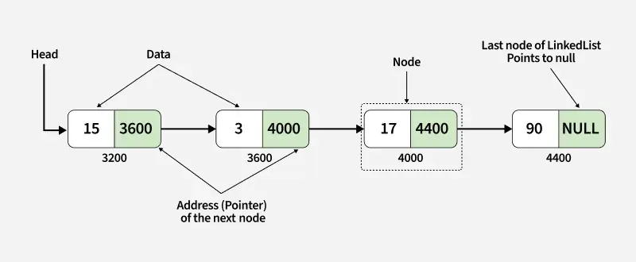

A linked list is a fundamental data structure in computer science. It mainly allows efficient insertion and deletion operations compared to arrays (in case of python List). Like arrays, it is also used to implement other data structures like stack, queue and deque.

A linked list is a type of **linear data structure** individual items are not necessarily at contiguous locations. The individual items are called nodes and connected with each other using links:

- A node contains two things first is data and second is a link that connects it with another node.
- The first node is called the head node and we can traverse the whole list using this head and next links.




To understand the value of a linked list, we must first look at how standard lists (arrays) are represented in memory.

### Contiguous Arrays
In a standard array or list-backed structure, elements are stored **contiguously** (consecutively) in memory. For instance, if a list begins at memory address `100`, the next element resides at `101`, followed by `102`, and so on.

```
Memory Address:  [100]    [101]    [102]    [103]
Array Element:  [Apple]  [Banana]  [Grape]  [Orange]
```

* **Advantage**: Fast random access. Finding an element at index `5` is a constant-time operation ($O(1)$) because the CPU can compute the exact memory offset instantly: `start_address + index`.
* **Disadvantage**: Slow insertions at the beginning. Inserting an element at index `0` forces the computer to shift all subsequent elements to the right by one position, which takes linear time ($O(n)$).

### Linked Lists
A **Linked List** stores elements in arbitrary locations in memory. Instead of relying on consecutive layout, each item in the list is wrapped in an object called a **Node**. Each node contains both its data value and a reference (pointer) to the next node in the list.

```
Node A (Addr: 50)         Node B (Addr: 1632)        Node C (Addr: 800)
[ Val: 69 | Next: 1632 ] ---> [ Val: 42 | Next: 800 ] ---> [ Val: 11 | Next: None ]
```

* **Advantage**: Fast insertions and deletions. Inserting an element at the beginning or middle of a list does not require shifting elements in memory; you only need to update references.
* **Disadvantage**: No random access. You cannot jump directly to a specific index (e.g., `list[5]`). To find an element, you must traverse the pointer chain from the beginning.

### The Node Structure

At the heart of the linked list is the **Node** class. It stores the value and the pointer to the next element.

```python
class Node:
    def __init__(self, val):
        """Initializes a node with a value and a next pointer set to None."""
        self.val = val
        self.next = None

    def set_next(self, node):
        """Sets the reference to the next node."""
        self.next = node
```

!!! example "Usage Example"
    To construct a linked list manually:
    ```python
    fruits = Node("banana")
    grape_node = Node("grape")
    fruits.set_next(grape_node)
    ```


### Working

Instead of laying items out side by side in memory, a **linked list** lets each item live wherever it wants in memory. What holds them together isn't physical closeness — it's a pointer.

Each item is a **node**, and a node has two things:
- `val` — the actual value you care about
- `next` — a reference to the next node in the chain

So you might have a node at memory address 50 holding the value `69`, and its `next` points to memory address 1,632 where the next node lives. That node's `next` points somewhere else. This keeps going until the last node, whose `next` is `None`. That `None` is how you know you've reached the end.


### Insertion

Say you want to insert a new node between two existing ones. With a regular list, you'd have to shift everything after the insertion point. With a linked list, you just update two pointers:

- The node *before* your new one: update its `next` to point to the new node
- The new node itself: set its `next` to point to the node that comes after it

That's it. Two reference updates, no shifting. **O(1)** regardless of list size.

### The tradeoffs 

Linked lists are genuinely useful, but they come with real costs — and most of the time, a regular list wins.

What linked lists are bad at:
- **Iteration** — following pointer chains is slower than iterating over contiguous memory, even if Big-O looks the same. CPUs are optimized for sequential memory access.
- **Random access** — you can't do `list[5]`. You have to walk the chain one node at a time.
- **Memory overhead** — every node carries an extra pointer on top of its value.

What they're genuinely good at:
- **O(1) insertions and deletions at known positions** — especially the head and tail, which is exactly what a queue needs.

