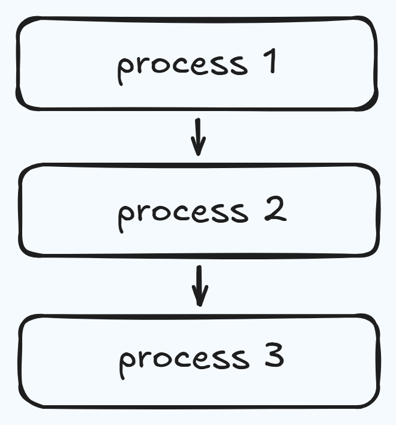
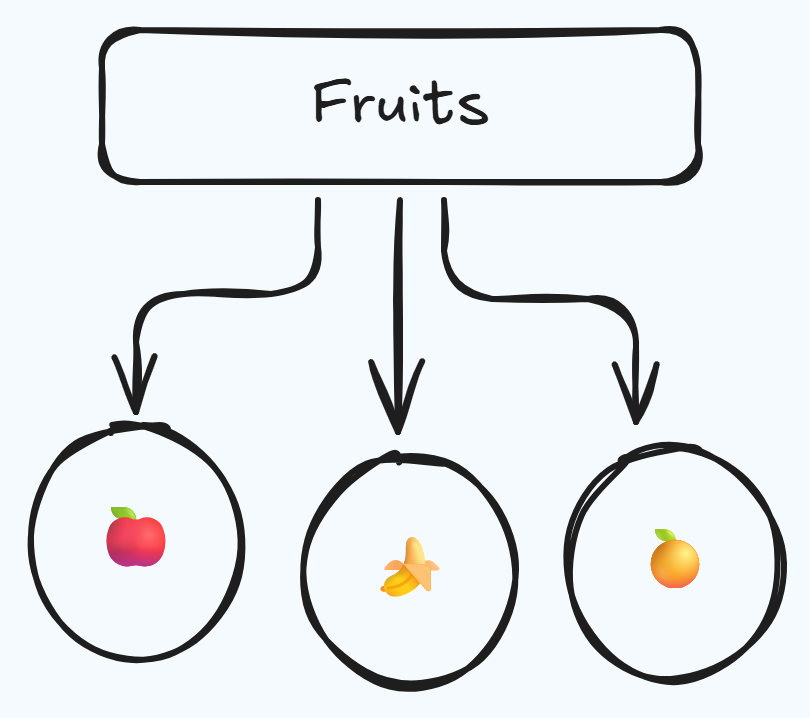

# Object-Oriented Programming

!!! warning "Work in Progress"

    This page covers the *why* of OOP and the contrast with procedural programming.
    The concepts section — classes, objects, inheritance, and the rest — will be added soon.

---

I learned C first. Because of that, the procedural way of thinking was the only way I knew Functions, global data, top-down flow — that was just "how programming worked" in my head.

OOP didn't make sense to me until I stopped asking *"what is it?"* and started asking *"why does it exist?"*
This page is my answer to that question.

---

## Procedural Programming

Procedure-oriented programming is a paradigm centered on functions and routines. You break a program into a linear, top-down sequence of steps. The focus is on *how* to do things — the process, the algorithm, the steps.

C is a good example of this. And since C was my first language, this was my default way of thinking.

<figure markdown="span">
    {width="400"}
</figure>

**How it works:**

- The program starts with a main routine and breaks down into smaller functions
- Data is often global — shared and accessible across the entire program
- Functions can be reused, but there's no concept of things *owning* their own data

### Characteristics of Procedural Programming

- Follows a **top-down approach**, where the program is broken into smaller functions step by step (e.g., `main() → input() → process() → output()`)  
- Focuses on **procedures (functions)** — how the task is performed  
- Uses **shared/global data**, which can be accessed and modified by multiple functions  
- Supports **basic code reuse** through functions, but lacks advanced reuse like inheritance  

**Where it works well:** simple programs, scripts, small utilities.

### Advantages of Procedural Programming

- Simple and easy to understand for beginners  
- Efficient in terms of memory and performance for small programs  
- Clear step-by-step flow makes logic straightforward  

**Where it breaks down:** once the program grows, global data becomes dangerous, functions start depending on each other in unpredictable ways, and every change risks breaking something elsewhere.

### Disadvantages of Procedural Programming

- Becomes difficult to manage as the program grows  
- Global data can lead to **security and data integrity issues**  
- Harder to reuse and extend code for larger systems  
- Changes in one part can affect other parts unexpectedly  

---

## Why OOP exists 

Imagine a guy named Arun who learned programming using C.

One day he gets a job managing a small restaurant system. At first he writes everything the way he learned separate functions for taking orders, updating stock, calculating bills. It works fine... until things grow.

Now there are multiple waiters, hundreds of items, discounts, different customer types. His code becomes a mess. Every change breaks something else. He's spending more time fixing old code than building new features.

Then someone shows him a different way.

*"Think of your program like your restaurant."*

Instead of scattered functions, you create objects:

- A **Customer** — with a name, an order, a bill
- An **Item** — with a price and stock
- An **Order** — with items and a total

Now each thing manages itself. If you want to change how billing works
you go to the `Order` — not hunt through 50 functions. 
If you need a new type of customer (VIP), you don't rewrite everything — you just extend it.

That's Object-Oriented Programming.

You don't use it because it's fancy.
You use it because once your program stops being small,
the "functions everywhere" approach collapses.
OOP gives structure. It turns chaos into systems.
It lets you think like an engineer instead of just someone writing instructions.

## Object-Oriented Programming

Object-Oriented Programming is a paradigm centered on **objects and data models**. You organize a program around real-world entities, where each object combines data (attributes) and behavior (methods). Instead of writing a linear sequence of steps, you structure your code as interacting components. The focus is on **what things are and what they can do**, rather than just the procedure to follow.

<figure markdown="span">
    {width="400"}
</figure>

### Advantages of OOP

- Provides a clear structure to programs
- Makes code easier to maintain, reuse, and debug
- Helps keep your code **DRY (Don't Repeat Yourself)**
- Allows you to build reusable applications with less code

!!! note "DRY principle"
    The **DRY principle** means you should avoid writing the same code more than once. Move repeated code into functions or classes and reuse it.

---

## Coffee Machine

This is the clearest way I found to understand the difference. The same coffee machine program, written in both styles. Same functionality. Very different structure.

---

### Procedural way

Everything lives in one file. Global data. Functions that reach into shared state.

```python title="coffee_machine_procedural.py"
MENU = {
    "espresso": {
        "ingredients": {
            "water": 50,
            "coffee": 18,
        },
        "cost": 1.5,
    },
    "latte": {
        "ingredients": {
            "water": 200,
            "milk": 150,
            "coffee": 24,
        },
        "cost": 2.5,
    },
    "cappuccino": {
        "ingredients": {
            "water": 250,
            "milk": 100,
            "coffee": 24,
        },
        "cost": 3.0,
    }
}

profit = 0
resources = {
    "water": 300,
    "milk": 200,
    "coffee": 100,
}

def report():
    print(f"""
    Water: {resources["water"]}ml
    Milk: {resources["milk"]}ml
    Coffee: {resources["coffee"]}g
    Money: ${profit}
    """)

def check_resources(input):
    order_ingredients = MENU[input]["ingredients"]
    for item in order_ingredients:
        if order_ingredients[item] > resources[item]:
            print(f"Sorry there is not enough {item}.")
            return False
    return True

def process_coins():
    print("Please insert coins.")
    try:
        total = int(input("how many quarters?: ")) * 0.25
        total += int(input("how many dimes?: ")) * 0.1
        total += int(input("how many nickles?: ")) * 0.05
        total += int(input("how many pennies?: ")) * 0.01
    except ValueError:
        print("Invalid input. Please enter numeric values.")
        return 0
    return total

def check_price(price, input):
    cost = MENU[input]["cost"]
    if cost <= price:
        change = round(price - cost, 2)
        print(f"Here is ${change} in change.")
        global profit
        profit += cost
        return True
    else:
        print("Sorry that's not enough money. Money refunded.")
        return False

def make_coffee(input):
    order_ingredients = MENU[input]["ingredients"]
    for item in order_ingredients:
        resources[item] -= order_ingredients[item]
    print(f"Here is your {input} ☕️. Enjoy!")

end_of_program = False
while not end_of_program:
    user_choice = input("What would you like? (espresso/latte/cappuccino): ").lower()
    if user_choice == "off":
        print("The System is shutting down for maintenance......")
        end_of_program = True
    elif user_choice == "report":
        report()
    else:
        if user_choice in MENU:
            if check_resources(user_choice):
                total = process_coins()
                if total > 0 and check_price(total, user_choice):
                    make_coffee(user_choice)
            else:
                continue
        else:
            print("Invalid choice. Please select from espresso, latte, or cappuccino.")
            continue
```

It works. But notice — `profit` and `resources` are global. Any function can touch them.
`check_price` modifies `profit` directly. If something goes wrong, you have to trace
through every function to find where the data changed.

Now imagine this program with ten more features. That's Arun's problem.

---

### Object oriented way

Same program. Split across four files. Each class owns its own data and behavior.

```python title="coffee_maker.py"
class CoffeeMaker:
    """Models the machine that makes the coffee"""
    def __init__(self):
        self.resources = {
            "water": 300,
            "milk": 200,
            "coffee": 100,
        }

    def report(self):
        """Prints a report of all resources."""
        print(f"Water: {self.resources['water']}ml")
        print(f"Milk: {self.resources['milk']}ml")
        print(f"Coffee: {self.resources['coffee']}g")

    def is_resource_sufficient(self, drink):
        """Returns True when order can be made, False if ingredients are insufficient."""
        can_make = True
        for item in drink.ingredients:
            if drink.ingredients[item] > self.resources[item]:
                print(f"Sorry there is not enough {item}.")
                can_make = False
        return can_make

    def make_coffee(self, order):
        """Deducts the required ingredients from the resources."""
        for item in order.ingredients:
            self.resources[item] -= order.ingredients[item]
        print(f"Here is your {order.name} ☕️. Enjoy!")
```

```python title="menu.py"
class MenuItem:
    """Models each Menu Item."""
    def __init__(self, name, water, milk, coffee, cost):
        self.name = name
        self.cost = cost
        self.ingredients = {
            "water": water,
            "milk": milk,
            "coffee": coffee
        }


class Menu:
    """Models the Menu with drinks."""
    def __init__(self):
        self.menu = [
            MenuItem(name="latte", water=200, milk=150, coffee=24, cost=2.5),
            MenuItem(name="espresso", water=50, milk=0, coffee=18, cost=1.5),
            MenuItem(name="cappuccino", water=250, milk=50, coffee=24, cost=3),
        ]

    def get_items(self):
        """Returns all the names of the available menu items"""
        options = ""
        for item in self.menu:
            options += f"{item.name}/"
        return options

    def find_drink(self, order_name):
        """Searches the menu for a particular drink by name."""
        for item in self.menu:
            if item.name == order_name:
                return item
        print("Sorry that item is not available.")
```

```python title="money_machine.py"
class MoneyMachine:

    CURRENCY = "$"

    COIN_VALUES = {
        "quarters": 0.25,
        "dimes": 0.10,
        "nickles": 0.05,
        "pennies": 0.01
    }

    def __init__(self):
        self.profit = 0
        self.money_received = 0

    def report(self):
        """Prints the current profit"""
        print(f"Money: {self.CURRENCY}{self.profit}")

    def process_coins(self):
        """Returns the total calculated from coins inserted."""
        print("Please insert coins.")
        for coin in self.COIN_VALUES:
            self.money_received += int(input(f"How many {coin}?: ")) * self.COIN_VALUES[coin]
        return self.money_received

    def make_payment(self, cost):
        """Returns True when payment is accepted, or False if insufficient."""
        self.process_coins()
        if self.money_received >= cost:
            change = round(self.money_received - cost, 2)
            print(f"Here is {self.CURRENCY}{change} in change.")
            self.profit += cost
            self.money_received = 0
            return True
        else:
            print("Sorry that's not enough money. Money refunded.")
            self.money_received = 0
            return False
```

```python title="main.py"
from menu import Menu
from coffee_maker import CoffeeMaker
from money_machine import MoneyMachine

coffeemaker = CoffeeMaker()
moneymachine = MoneyMachine()
menus = Menu()

end_of_program = False

while not end_of_program:
    user_input = input(f"What would you like? {menus.get_items()} :").lower()
    if user_input == "off":
        print("The System is shutting down for maintenance......")
        end_of_program = True
    elif user_input == "report":
        coffeemaker.report()
        moneymachine.report()
        continue
    else:
        menu_item = menus.find_drink(user_input)
        if menu_item is None:
            continue
        if coffeemaker.is_resource_sufficient(menu_item):
            if moneymachine.make_payment(menu_item.cost):
                coffeemaker.make_coffee(menu_item)
```

---

### What actually changed

The functionality is identical. But look at `main.py` in the OOP version —
it reads almost like plain English. You can understand what the program does
without reading a single other file.

More importantly: `profit` is no longer a global variable floating around.
It belongs to `MoneyMachine`. `resources` belongs to `CoffeeMaker`.
If something breaks, you know exactly where to look.

That's the shift. Not just cleaner code — **clearer ownership.**

When something breaks, you don't search. You go to the class that owns that thing.

In Object-Oriented Programming, I can modify internal implementation as long as the interface (input/output) stays the same, without needing to understand the entire system.

---

## Core concepts in OOP

### Class

**Class:** A structural blueprint that defines the data attributes and behaviors (methods) for a specific type of entity. It dictates the architecture of what an entity will be, but it allocates no memory on its own.

- Class is non primitive (user defined) data type, it is combination of characteristics and behaviors.

For example, take a class of sixty students. If you want to store one student in the database, we will write their name and register number. But what if another student comes? We would again write variables for name and reg no. This way, multiple memory locations are allocated to different variables, but they are all doing the same work.

Here, we know that name and reg no. are common for every student—whether there are 50 or 100. So in this case, we can store name and reg no. as a blueprint called a **class**. Whenever a new student is added or removed, we simply update the value of that variable (i.e., create a new object or modify an existing one).

So a **class** is a structure that defines what an object can do, and the **object** does the actual work.

### Object

**Object:** A concrete, usable instance created from a class blueprint that occupies memory and holds its own specific data values. If a class is the architectural schematic for a building, the object is the physical building itself.

- An attribute is just a fancy word for a variable that's associated with a modeled object.
- A method goes along the same vein. As you can clearly see, these are just functions, but we call it a method because it's a function that a particular modeled object can do.
- In OOP, we're trying to model real-life objects, and those objects have things, and they also can do things. The things that they have are their attributes(variables), and these are usually modeled with variables. The things that they can do are called methods(functions), and they are modeled by functions.
- In OOP, we refer to the blueprint or template as a class. And we call the individual objects that are generated from the blueprint an object.

#### Example of Class and object

```python title="Class & Object.py"
# A constructor(__init__) is a special part of a class (blueprint) that runs when an object is created. 
# It sets up the object with initial values or actions—this is called initialization.

class Car:
    def __init__(self):
        # initialise attributes
        pass

# the init function is going to be called every time you create a new object from this class.

#------EXAMPLE------#

#----CREATING CLASS, ATTRIBUTES AND METHODS----#
 
class User:
    def __init__(self,user_id,username):
        self.id = user_id
        self.username = username
        self.followers = 0 # Default value (no need to pass it)  
        self.following = 0

# now we've created a new user, we're initializing it with these starting 
# values where the first value is going to become the user ID which is going to be the self.id,
# and the second value is going to become the self.username.

    # when a function is attached to an object then it's called a method.
    def follows(self, user): 
        self.following += 1
        user.followers +=1

# when a user decides to follow another user, well in this case,
# the user who we're following, their follower count goes up by one and our own,
# so the self.following count goes up by one as well.

user_1 = User(user_id="001", username="Hariprasad") # object 1
user_2 = User("002", "Nandu")                       # object 2

# remember that when you add parameters to the constructor which is the init function, 
# you're now saying that whenever a new object is being constructed from this class,
# it must provide these two pieces of data.

user_1.follows(user_2)

# here user 1 follows user 2 so user 1's following and users 2's followers increases by one

print(f"user 1's following : {user_1.following}")
print(f"user 1's followers : {user_1.followers}")
print(f"user 2's following : {user_2.following}")
print(f"user 2's followers : {user_2.followers}")
```


- **Inheritance:** A mechanism where a new class automatically adopts the properties and behaviors of an existing parent class. This establishes a logical hierarchy and promotes clean code reuse as your systems scale over time.

- **Abstraction:** The practice of exposing only the necessary, high-level interactions of a system while hiding the complex, underlying execution logic. It allows developers to interact with powerful systems efficiently without getting bogged down in the internal wiring.

- **Polymorphism:** The ability to treat different objects interchangeably through a shared interface, even if their underlying executions differ. It keeps your architecture flexible, allowing a single command to trigger different, appropriate behaviors depending on the specific object receiving it.

- **Encapsulation:** The strict bundling of data and the methods that operate on it into a single, secure container, restricting unauthorized external access. It acts as a protective boundary, ensuring an object's internal state cannot be arbitrarily altered or corrupted by outside interference.

