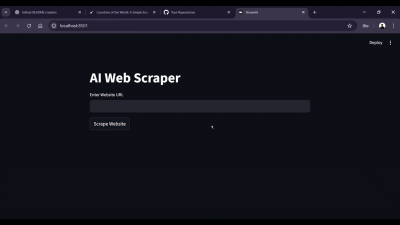

# Scrappy AI 🤖

An AI-powered web scraper that extracts, cleans, and parses website data using Selenium, BeautifulSoup, and the Google Gemini API — with a Streamlit interface for interaction.

**Repo:** [Scrappy AI](https://github.com/har1prasad/AI_based_webscrapper)

---



---

## What this project is

This is the most complex project I've built so far — and the first one that genuinely felt like something beyond a learning exercise.

I followed a tutorial to understand the foundation, but the path I took to finish it was different from what the tutorial intended. That gap is where most of the real learning happened.

For the first time, I was connecting multiple moving parts, a browser automation tool, an HTML parser, an external AI API, and a UI layer all into one working system. Each piece worked differently, failed differently, and needed to be understood on its own before it could work with the others.

---

## Tech stack

- **Language:** Python 3.9+
- **Scraping:** Selenium, BeautifulSoup (bs4)
- **AI:** Google Gemini API
- **UI:** Streamlit
- **Other:** python-dotenv

---

## What it does

- Scrape most publicly accessible websites using Selenium and extracts the body content
- Cleans the DOM — removes scripts, styles, and noise
- Splits large content into manageable chunks for the AI to process
- Sends chunks to Gemini API with a user-defined prompt
- Returns structured, parsed output through a clean Streamlit interface

---

## Project structure

```
Scrappy_AI/
├── main.py          # Streamlit app
├── scrape.py        # Scraping and cleaning logic
├── parser.py        # AI parsing using Gemini
├── requirements.txt
└── .env.example     # Environment variables template
```

---

## What I actually learned

The most significant decision in this project wasn't planned, it was forced.

I initially tried to run the AI parsing locally using **Ollama**, which meant no API cost and full offline control. But the response times were too slow to be practical for this kind of use case. After spending time trying to make it work, I switched to the **Google Gemini API**.

That switch wasn't just a library change. It changed how I thought about the parsing logic, how I handled the API key securely using `.env`, and how I structured the requests. Switching mid-project and adapting the existing code taught me more about real decision-making in software than any tutorial step could.

The DOM chunking problem was also interesting. Websites produce large amounts of HTML, far more than an AI model can process in one call. Breaking the cleaned content into manageable chunks and sending them separately, then combining the results, was a problem I had to think through carefully. It introduced me to the idea that **data pipeline design matters** even in small projects.

Using Selenium for the first time also showed me how fragile browser automation can be. Websites behave differently, load at different speeds, and structure their HTML unpredictably. Writing scraping logic that handles this gracefully is harder than it looks.

---

## What I'd do differently now

The Ollama attempt wasn't wasted time but I'd make that call faster today. Knowing when to switch tools instead of fighting the wrong one is a judgment that only comes from making that mistake once.

I'd also separate the chunking logic more cleanly from the parsing logic. Right now they're closer together than they should be, which would make it harder to swap the AI provider again if needed.

A proper error handling layer would also make this significantly more robust — right now a failed scrape or a bad API response can break the flow in ways that aren't communicated clearly to the user.

---

> *This was the project where I stopped building things that run and started building
> things that think — and learned that connecting two powerful tools is harder,
> and more interesting, than using either one alone.*