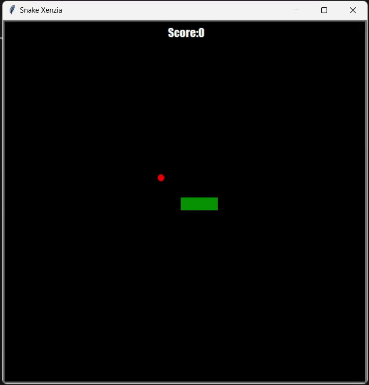

# Snake Xenzia 🐍

A recreation of the classic Snake Xenzia built using Python and the turtle library, focused on understanding real-time program flow and OOP design.

The goal is simple: **Eat. Grow. Survive.**

**Repo:** [Snake Xenzia](https://github.com/har1prasad/Snake-Xenzia-game)

---

<figure markdown="span">
  {width="440"}
</figure>

---

## What this project is

This was my first real attempt at building something that *felt* like a game not just a script that runs and exits, but something with a loop, a state, and a screen that reacts to input.

I built it as part of my GUI and OOP learning phase, but Snake Xenzia ended up teaching me more about software architecture than any tutorial exercise did. Separating the game into `Snake`, `Food`, and `ScoreBoard` classes forced me to think about *what each piece of code is responsible for* which is something I didn’t properly understand before this project.

---

## Tech stack

- **Language:** Python 3
- **Library:** `turtle` (built-in, no installation needed)
- **Concepts:** OOP, game loop, collision detection, modular design

---

## What it does

- Real-time snake movement with keyboard input
- Collision detection with food, wall, and self
- Live score display
- Game Over screen
- Clean, modular code across multiple Python files

---

## Project structure

```
/Snake game
├── main.py           # Main game loop
├── snake.py          # Snake movement and behavior
├── food.py           # Food creation and placement
├── Scoreboard.py     # Score tracking and Game Over message
└── demo.gif          # Gameplay preview
```

---

## What I actually learned

The biggest shift was understanding how to manage a **game loop**. Using `Screen.tracer()` and `Screen.update()` to control frame-by-frame rendering was something I had never thought about before, the idea that you can manually decide *when* the screen refreshes opened up a completely different way of thinking about real-time programs.

The collision detection was harder than I expected. Wall boundaries were straightforward, but **body collision** detecting when the snake hits itself, required me to think carefully about how the snake's position list updates on each move. I got it wrong multiple times before it clicked.

Separating logic into classes also changed how I debug. When something broke, I knew exactly *which file* to look at instead of scrolling through one long script trying to find where things went wrong. That was the moment OOP stopped being a concept and started being useful.

---

## What I'd do differently now

If I rebuilt this today I'd increase the game speed gradually as the score grows, handle the boundary logic more cleanly, and separate the game state from the rendering more explicitly.

I'd also add a start and pause menu, right now the game just begins immediately, which feels abrupt.

I also didn’t think much about extensibility at the time — adding new features now would require some restructuring.

---

> *This was the project where I stopped thinking of OOP as a topic to study and started thinking of it as a way to organize problems.*