# AI File Search Assistant [WIP]

> A desktop application for semantic, AI-powered local file search — built entirely in Python, operating fully offline.

---

## Project Synopsis

### Abstract

**AI File Search Assistant** is a desktop application that enables users to search files on their local computer using natural language queries. Instead of remembering exact file names, users can type queries such as *"my Python notes"* or *"invoice from January"*, and the system retrieves the most relevant files based on their **content and meaning**.

The application scans selected folders, extracts text from supported file formats, generates semantic embeddings using Sentence Transformers, and stores metadata in SQLite. FAISS is used for fast vector similarity search. The system is built entirely in Python with a PySide6 graphical interface and operates **fully offline**, ensuring privacy and security.

---

### Objectives

- Build a desktop application for semantic file search
- Extract content from multiple file types
- Generate embeddings using AI models
- Store file metadata in SQLite
- Use FAISS for fast similarity search
- Provide a user-friendly GUI
- Ensure complete offline operation

---

### Scope

The system supports the following file types:

| Category | Formats |
|---|---|
| Documents | `.pdf`, `.docx`, `.txt` |
| Data | `.csv` |
| Source Code | `.py`, `.java`, `.c`, `.cpp`, `.js` |

---

## Hardware & Software Configuration

### Hardware Requirements

| Component | Minimum Requirement |
|---|---|
| Processor | Intel Core i5 / AMD Ryzen 5 |
| RAM | 8 GB |
| Storage | 256 GB SSD |
| GPU | Optional |
| Internet | Required only for installation |

### Software Requirements

| Component | Technology |
|---|---|
| Programming Language | Python 3.10+ |
| GUI Framework | PySide6 |
| Database | SQLite |
| Embedding Model | Sentence Transformers (`all-MiniLM-L6-v2`) |
| Vector Search | FAISS |
| PDF Parsing | PyMuPDF |
| DOCX Parsing | python-docx |
| IDE | VS Code / PyCharm |
| Version Control | Git & GitHub |
| Operating System | Windows 10/11 or Linux |

---

## Module Description

The system is divided into **10 modules**, each handling a distinct responsibility.

### 1. User Management Module

Handles user registration, login authentication, search history tracking, and user settings.

### 2. Folder Management Module

Handles selecting folders to index, storing indexed folder paths, and enabling or disabling folders.

### 3. File Indexing Module

Handles recursive folder scanning, metadata collection, and detecting modified or new files.

### 4. Content Extraction Module

Extracts text from the following formats: PDF, DOCX, TXT, CSV, and source code files.

### 5. Embedding Generation Module

Converts extracted text into semantic vectors using the Sentence Transformers library (`all-MiniLM-L6-v2`).

### 6. Vector Index Module

Stores embedding vectors in FAISS and performs nearest-neighbour similarity search.

### 7. Semantic Search Module

Processes natural language queries, generates a query embedding, and retrieves the most relevant files.

### 8. Database Management Module

Manages all SQLite database operations — inserts, updates, queries, and schema management.

### 9. File Preview Module

Displays extracted text content for a selected search result inside the GUI.

### 10. Desktop GUI Module

Provides the full graphical interface including: login form, main dashboard, search interface, and preview pane.

---

## Data Flow Diagrams

### 1. User Management Module

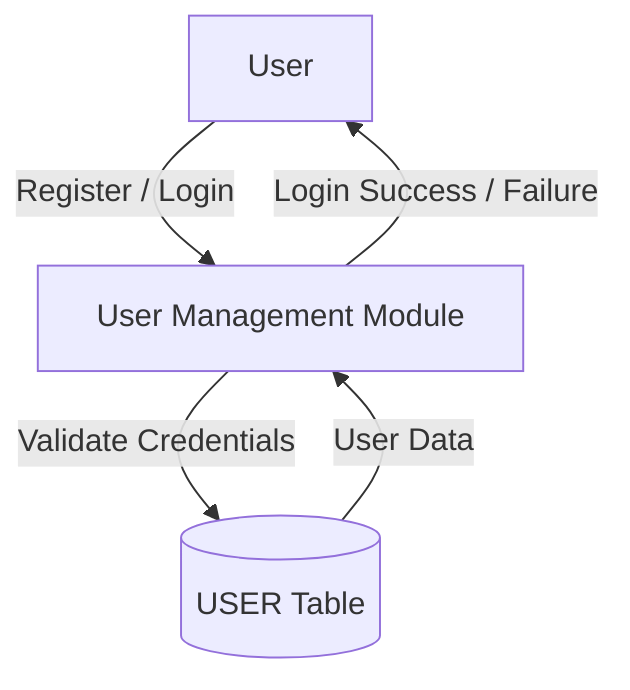

---

### 2. Folder Management Module

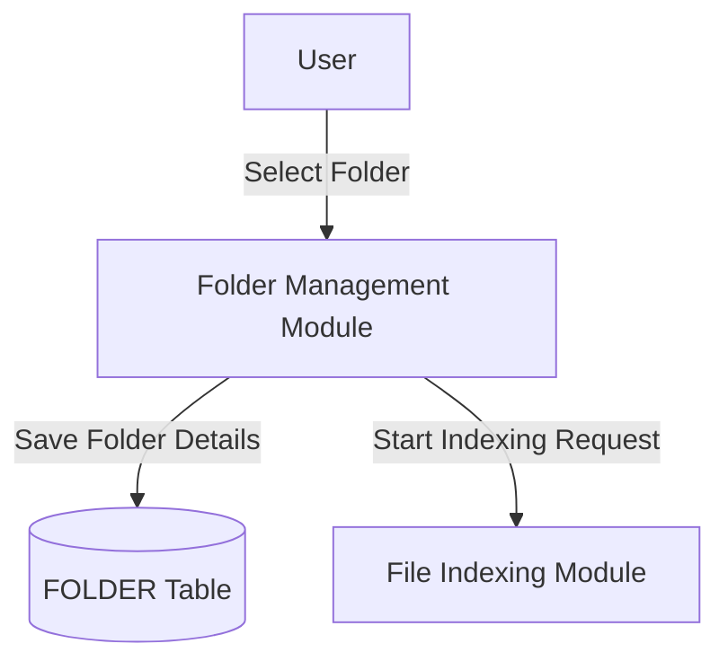

---

### 3. File Indexing Module

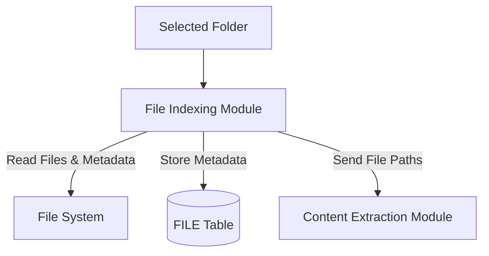

---

### 4. Content Extraction Module

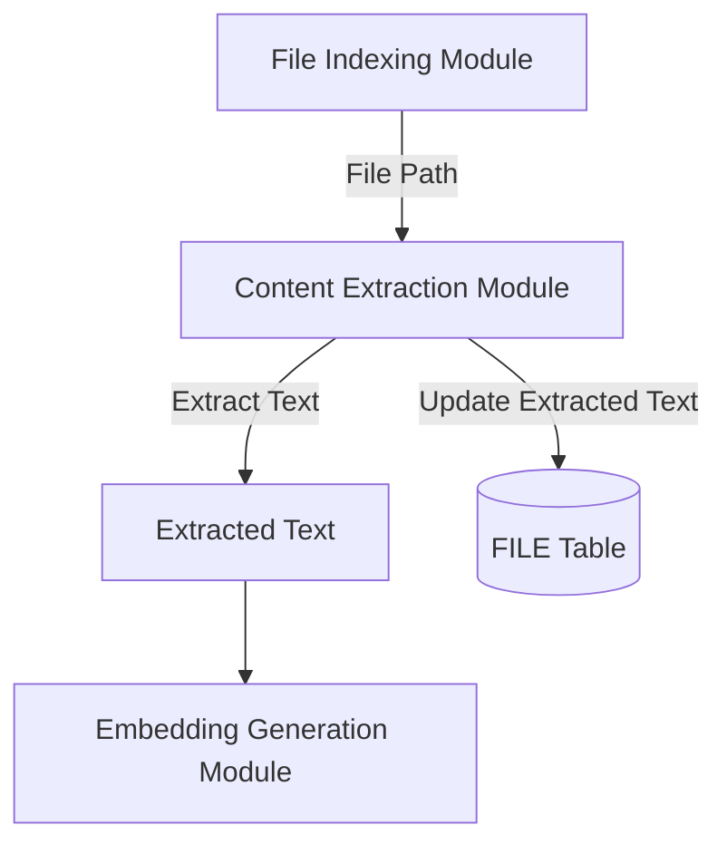

---

### 5. Embedding Generation Module

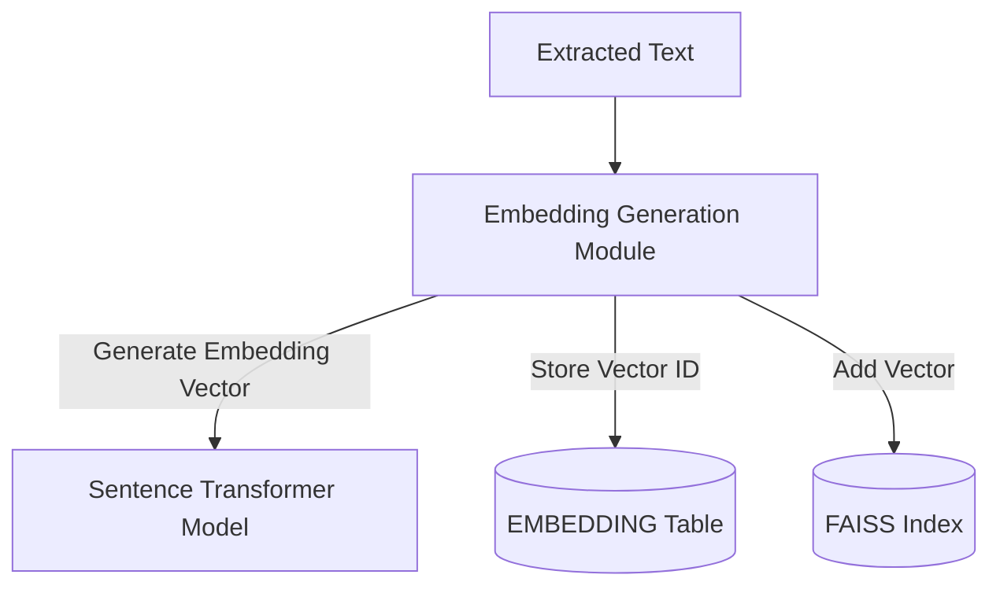

---

### 6. Semantic Search Module

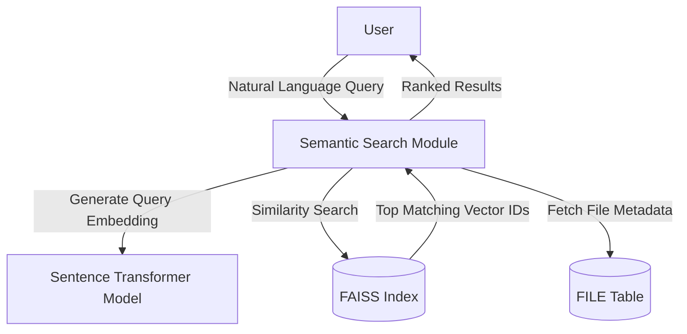

---

### 7. File Preview Module

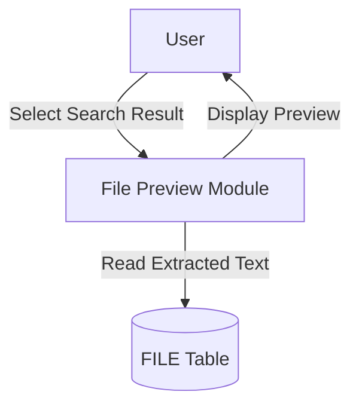

---

### 8. Search History Module

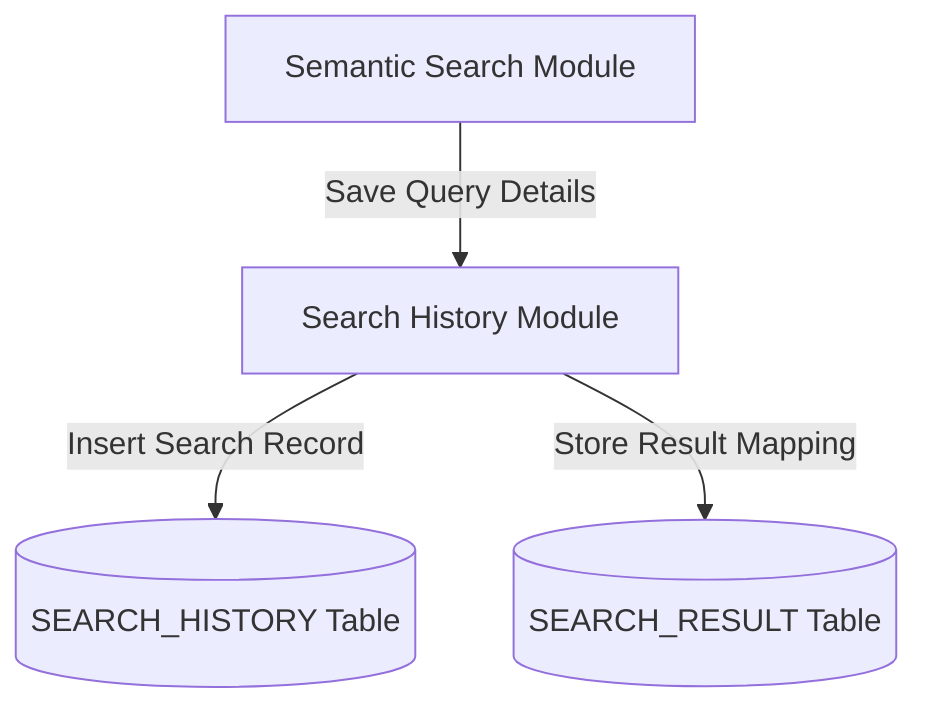

---

### 9. Desktop GUI Module

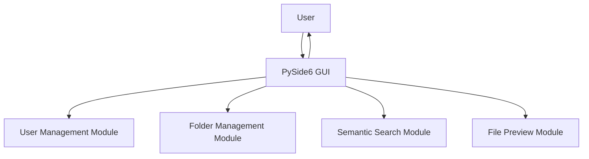

---

### 10. Overall System DFD (Level 1)

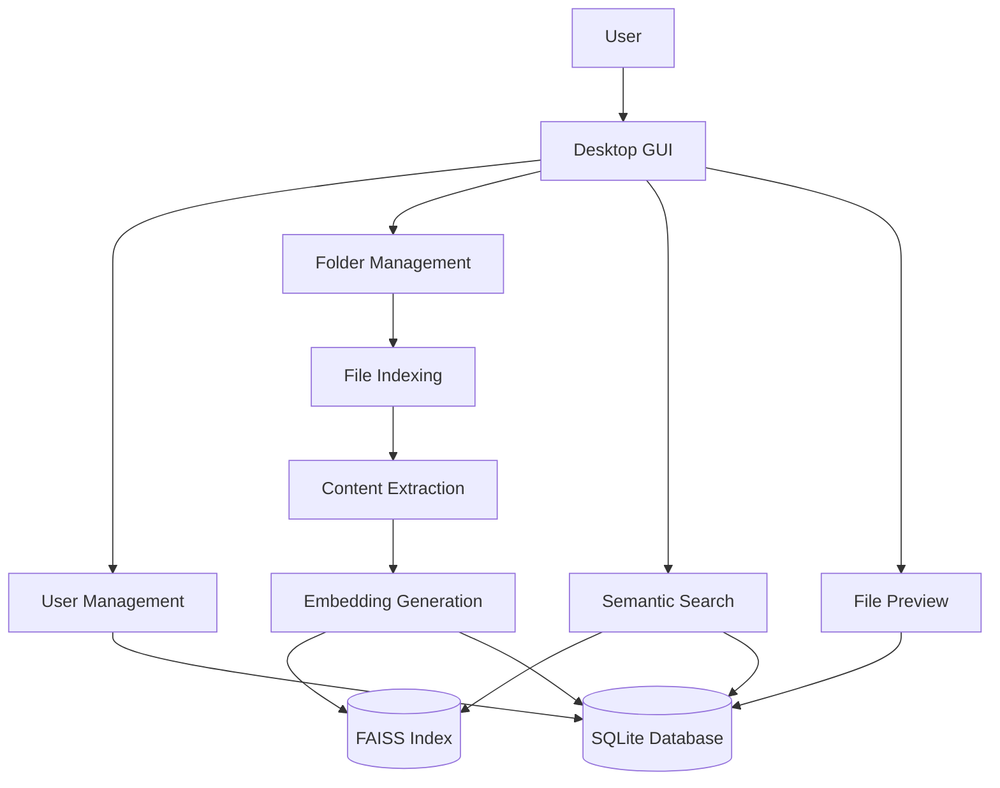

---

## Database Design

### Entity-Relationship Diagram

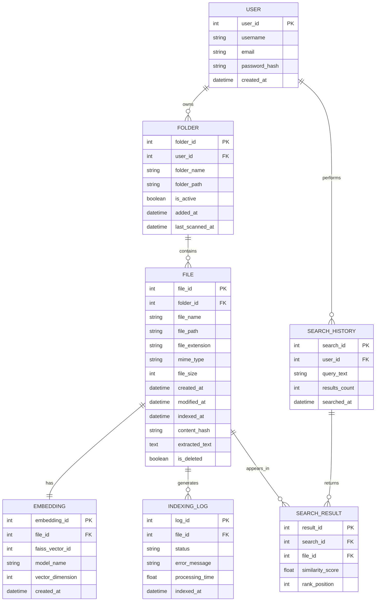

---

### Database Connectivity

The project uses **SQLite** — a serverless, lightweight, and fast database engine well-suited for desktop applications.

```python
import sqlite3

def connect():
    return sqlite3.connect("data/file_index.db")
```

**Why SQLite?**

- Serverless and zero-configuration
- Lightweight with a small footprint
- Fast for read-heavy workloads
- Easy to distribute with the application
- Ideal for single-user desktop applications

---

### Table Schemas

#### USER Table

| Column | Type | Constraint |
|---|---|---|
| user_id | INTEGER | PRIMARY KEY |
| username | TEXT | UNIQUE |
| email | TEXT | UNIQUE |
| password_hash | TEXT | NOT NULL |
| created_at | DATETIME | DEFAULT CURRENT_TIMESTAMP |

#### FOLDER Table

| Column | Type | Constraint |
|---|---|---|
| folder_id | INTEGER | PRIMARY KEY |
| user_id | INTEGER | FOREIGN KEY |
| folder_path | TEXT | UNIQUE |
| folder_name | TEXT | NOT NULL |
| is_active | BOOLEAN | DEFAULT 1 |
| added_at | DATETIME | DEFAULT CURRENT_TIMESTAMP |

#### FILE Table

| Column | Type | Constraint |
|---|---|---|
| file_id | INTEGER | PRIMARY KEY |
| folder_id | INTEGER | FOREIGN KEY |
| file_name | TEXT | NOT NULL |
| file_path | TEXT | UNIQUE |
| file_extension | TEXT | NOT NULL |
| mime_type | TEXT | — |
| file_size | INTEGER | — |
| modified_at | DATETIME | — |
| indexed_at | DATETIME | — |
| content_hash | TEXT | — |
| extracted_text | TEXT | — |

#### EMBEDDING Table

| Column | Type | Constraint |
|---|---|---|
| embedding_id | INTEGER | PRIMARY KEY |
| file_id | INTEGER | FOREIGN KEY |
| faiss_vector_id | INTEGER | UNIQUE |
| model_name | TEXT | — |
| vector_dimension | INTEGER | — |
| created_at | DATETIME | DEFAULT CURRENT_TIMESTAMP |

#### SEARCH_HISTORY Table

| Column | Type | Constraint |
|---|---|---|
| search_id | INTEGER | PRIMARY KEY |
| user_id | INTEGER | FOREIGN KEY |
| query_text | TEXT | NOT NULL |
| results_count | INTEGER | — |
| searched_at | DATETIME | DEFAULT CURRENT_TIMESTAMP |

#### SEARCH_RESULT Table

| Column | Type | Constraint |
|---|---|---|
| result_id | INTEGER | PRIMARY KEY |
| search_id | INTEGER | FOREIGN KEY |
| file_id | INTEGER | FOREIGN KEY |
| similarity_score | REAL | — |
| rank_position | INTEGER | — |

#### INDEXING_LOG Table

| Column | Type | Constraint |
|---|---|---|
| log_id | INTEGER | PRIMARY KEY |
| file_id | INTEGER | FOREIGN KEY |
| status | TEXT | — |
| error_message | TEXT | — |
| processing_time | REAL | — |
| indexed_at | DATETIME | DEFAULT CURRENT_TIMESTAMP |

---

## Form Design

### Login Form

| Element | Type |
|---|---|
| Username | Text Input |
| Password | Password Input |
| Login | Button |
| Register | Button |

---

### Registration Form

| Element | Type |
|---|---|
| Username | Text Input |
| Email | Text Input |
| Password | Password Input |
| Confirm Password | Password Input |
| Register | Button |
| Back to Login | Button |

---

### Main Dashboard

The dashboard is divided into four sections:

**Search Section**

- Search bar
- Search button

**Folder Section**

- Add Folder
- Remove Folder
- Reindex button

**Filters**

- File type filter
- Date range filter
- Size range filter

**Results Table**

| Column | Description |
|---|---|
| File Name | Name of the matched file |
| Type | File extension/type |
| Similarity Score | Relevance score from FAISS |
| Modified Date | Last modified timestamp |

**Preview Pane** — displays extracted text content of the selected result.

---

### Settings Form

| Setting | Options |
|---|---|
| Model Selection | Choose embedding model |
| Theme | Light / Dark |
| Max Search Results | Configurable integer |

---

## Conclusion

The **AI File Search Assistant** successfully demonstrates how artificial intelligence can be applied to improve file retrieval on personal computers. By combining content extraction, semantic embeddings, FAISS vector search, SQLite database management, and a PySide6 graphical interface, the system allows users to locate files based on **meaning** rather than exact file names.

The application operates fully offline, ensuring complete privacy and making it suitable for personal and professional use. The project showcases practical integration of NLP, machine learning, databases, and desktop application development, providing a strong foundation for future enhancements such as:

- Voice-based search
- Image content search
- Cross-platform packaging (macOS, Linux)
- Cloud synchronisation support