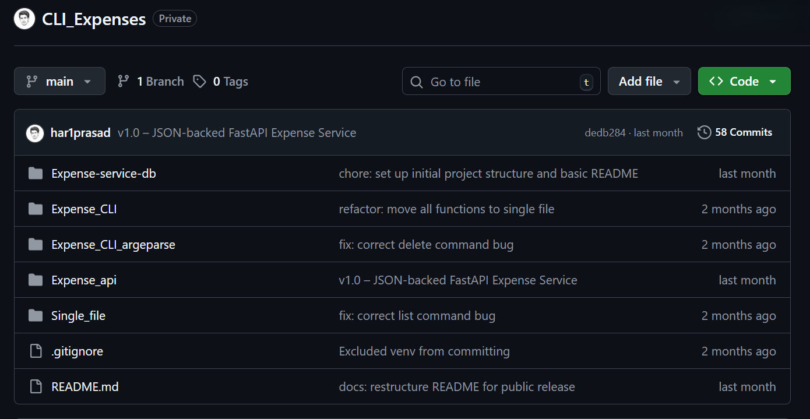

# Expense Tracker (Work in Progress) 🛠️

This is not a finished project.

This is something I am actively building to improve how I think about systems, structure, and real-world application design.

**Repo:** Link will be provided when i complete my learning

---

## What this is

This project is my attempt to move beyond small scripts and start building something that evolves over time.

Instead of jumping between different ideas, I chose one problem — an expense tracker — and started rebuilding it multiple times with better structure and better decisions.

Right now, the repo contains multiple stages:
- A basic single-file script
- A modular CLI version
- An argparse-based CLI
- An early FastAPI backend

Each stage represents how my thinking changed, not just how the code changed.

---

## What I am trying to learn

Right now, the focus is not features — it’s structure.

- How to break a program into responsibilities
- How to move from scripts → tools → systems
- How to design something that can grow without becoming messy
- How real applications are structured (not just how they run)

The shift I’m working on is:
> from writing code that works → to designing systems that make sense

---

## Current state

- CLI versions are functional and usable
- Argparse version feels closer to a real tool (but no one will use it, who uses a cli expense tracker)
- FastAPI version is still early and incomplete

The API stage is where things are starting to feel different — exposing logic through endpoints instead of directly running functions forced me to rethink how everything is structured.

---

## What I’ve realized so far

- Writing working code is easy compared to organizing it properly
- Most complexity comes from managing state and structure, not features
- Rebuilding the same project teaches more than starting new ones
- My earlier versions worked, but didn’t scale or feel clean

---

## What I’m focusing on next

- Improving the FastAPI layer
- Separating business logic from API routes
- Introducing proper data handling (moving beyond simple JSON)
- Preparing for a database-backed version

---

## What this project is NOT (yet)

- Not production-ready
- No authentication
- No database design
- No deployment

That will come later — right now I’m building the foundation.

---

## Why I’m doing this

I realized that jumping between projects made me feel like I was progressing, but my thinking wasn’t improving enough.

So I changed the approach:

> One idea. Multiple implementations. Increasing depth.

---

## Final note

This project is intentionally unfinished.

It exists to show how my thinking is changing, not just what I’ve built.

