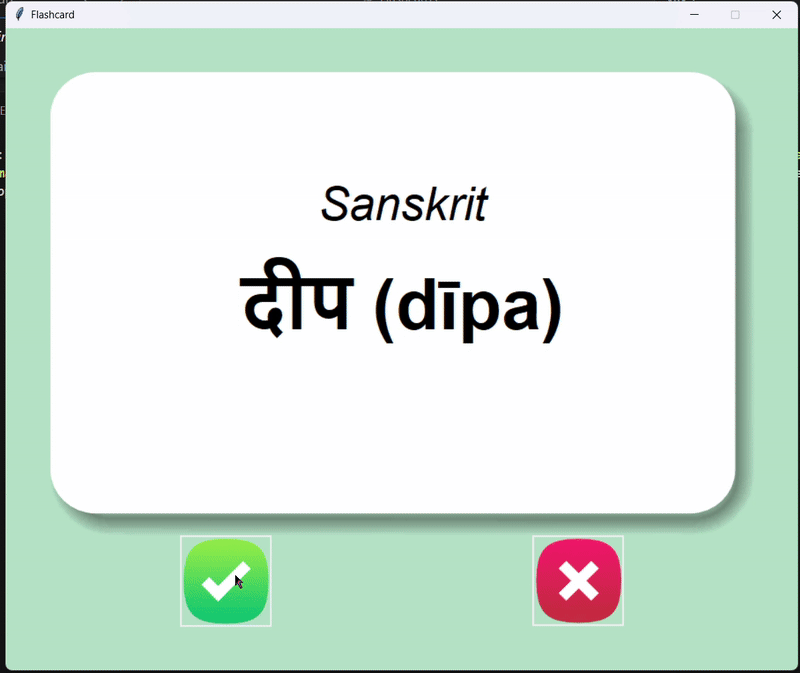

# Flashcard App 📚

A flashcard application built with Python and Tkinter that mimics physical flashcards,
flipping automatically to reveal meanings and tracking which words you've already learned.

**Repo:** [FlashcardApp](https://github.com/har1prasad/Flashcard-Learning-App)

---

<figure markdown="span">
  {width="440"}
</figure>

---

## What this project is

This was my first real GUI project where the app needed to *remember something* between sessions.

Most of my earlier projects were stateless — run, do something, exit. The Flashcard App introduced me to the idea of **persistence**: saving what the user has learned to a CSV file and loading only the remaining words on the next run. That shift from "program that runs" to "program that remembers" was a meaningful one.

I also built it to be flexible — it works with any two-column CSV, so I used it with Sanskrit vocabulary while building it, which made testing actually useful.

---

## Tech stack

- **Language:** Python 3
- **Library:** Tkinter (built-in), Pandas
- **Concepts:** OOP, file I/O, GUI event handling, state persistence

---

## What it does

- Displays a flashcard and automatically flips it after 3 seconds to show the meaning
- Tracks learned words — marked words are saved and removed from the review pool
- Loads from a saved progress file on restart so you continue where you left off
- Works with any language or vocabulary CSV with two columns

---

## Project structure

```
FlashcardApp/
├── data/
│   ├── desired_language_words.csv    # Source word list
│   ├── words_learned.csv             # Created at runtime
│   └── words_to_learn.csv            # Created at runtime
├── images/
│   ├── card_front.png
│   ├── card_back.png
│   ├── right.png
│   └── wrong.png
└── main.py
```

---

## What I actually learned

The flip timer was a small thing that taught me something big. Using `window.after(3000, func=flipping)` to schedule a function call after a delay introduced me to **event-driven programming** — the idea that code doesn't always run top to bottom, but can be triggered by time or user actions. That's a pattern that shows up everywhere in GUI and backend work.

Managing the word pool was also more interesting than expected. The logic of "load from progress file if it exists, otherwise load from source" sounds simple but forced me to think carefully about how the app behaves on first run versus subsequent runs. Getting that fallback logic right took a few attempts.

---

## What I'd do differently now

The current implementation reads and writes CSV files directly in the main script. If I rebuilt this today I'd separate the data layer from the UI logic more cleanly — the file handling shouldn't be mixed into the same functions that control the card display.

I'd also implement a proper spaced repetition algorithm instead of a simple learned/not-learned split. The current version treats all unlearned words equally, but a smarter system would show harder words more frequently.

---

> *This was the project where I first understood that a good app isn't just about what it does — it's about what it remembers.*

